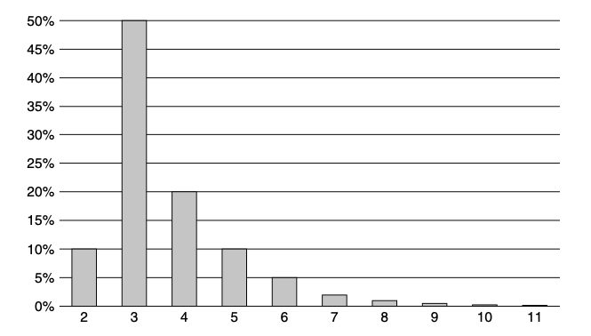
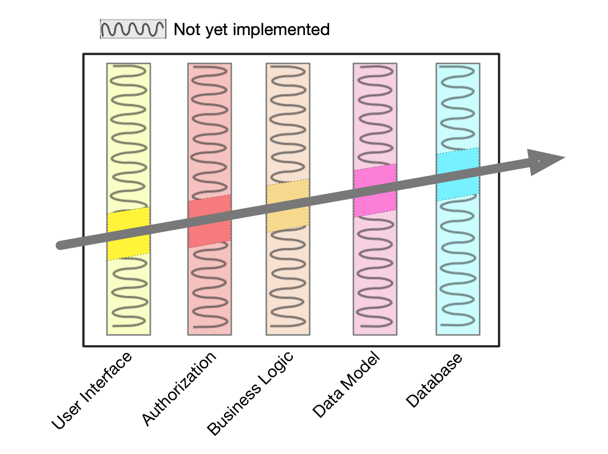

I recently finished reading both books: _The Pragmatic Programmer 20th Anniversary Edition_ (2019) and _The Clean Coder_ (2011) which are found on almost every “top 10 Software Development books” lists out there. My goal was to learn, improve, and get something a teacher from mine used to say: “_knowledge that can’t be obtained from just reading articles_.”

When you are developing software you may get stuck at a point where Youtube videos and Stackoverflow answers don’t help. You end up reaching for the official docs, or the source code of that technology to find the answer. The same thing happens when you want to understand the subject properly. **Articles fall short and reading well-known books is the best approach.**

These books focus not only on how to write code but on teaching you best practices for developing software and even useful life lessons. I’ll share some lessons I learned from them. 

## Table of Contents

- [Taking Responsibility](#Taking-Responsibility)
- [Testing](#Testing)
- [Teamwork](#Teamwork)
- [Estimating](#Estimating)
- [Tracer bullets](#Tracer-bullets)
- [Handling pressure](#Handling-pressure)
- [Refactoring](#Refactoring)
- [Main differences](#Main-differences)
- [Conclusions](#Conclusions)
- [Resources](#Resources)

## Taking Responsibility

As a software developer, you are responsible for the code you create and must ensure that it not only works now but will do in the best possible way for a long time (nothing lasts forever). The best way to make sure the code won’t fail is by testing it, having automated tests that you run each time you write new lines to be sure everything is still working.

> Take Responsibility. Responsibility is something you actively agree to.
> — The Pragmatic Programmer

Responsibility is not only related to coding, you have to **take responsibility for improving yourself** too and get better by scheduling time for it. 

> Professionals spend time caring for their profession. Presumably, you became a software developer because you are passionate about software and your desire to be a professional is motivated by that passion.
> — The Clean Coder

> Your knowledge and experience are your most important day-to-day professional assets.
> — The Pragmatic Programmer

## Testing

The gravity of testing in software development is such that both books focus on this topic. 

You have to **look at tests as the first users of your code**, so they are the best feedback that guides your coding.

Practice [TDD Test Driven Development.](https://en.wikipedia.org/wiki/Test-driven_development) How? Three steps explanation:

1 Choose a feature to add and write a test that will pass after implementing it. Now, all tests but the new one should pass. 

2 Write the code required to pass it. 

3 Refactor the code, and check all tests still pass.

Thus said, it is important to look at the big picture and not to miss the main goal by writing too many tests.

> It is easy to become seduced by the green "tests passed" message, writing lots of code that doesn’t actually get you closer to a solution.
> — The Pragmatic Programmer

There are three ways of testing: _First, During,_ and_ Never._ First (TDD) is the best one, During is a fallback when First is not useful, and Never is often called “Test Later” but sadly **in most cases Later means Never.**

> The need to test first forces you to think about "good design."
> — The Clean Coder

Having tests give you the confidence to refactor code more often because you have the tests to check if they still pass after the changes are done.

> Tests should be run as frequently as possible to provide maximum feedback and to ensure that the system remains continuously clean.
> — The Clean Coder

Use acceptance tests to _define when a requirement is done_ collaborating with the stakeholders.

Developers take the responsibility to ensure that tests are _always automated_ for a simple reason: **cost.**

Developers have to aim “QA should find nothing” as a goal by implementing different kinds of tests, in different measures from unit to exploratory ones.

## Teamwork

When working on a team you have to be a "team player", communicate frequently, keep an eye out for your teammates, and execute your responsibilities as well as possible.

> Good communication is key to avoiding these problems. And by "good" we mean instant and frictionless. Frictionless means it’s easy and low-ceremony to ask questions, share your progress, your problems, your insights and learnings, and to stay aware of what your teammates are doing.
> — The Pragmatic Programmer

](./tobias-mrzyk-iuqmGmst5Po-unsplash.jpg)

Teams should be **small, less than 10-12 members**, where everyone knows and trusts each other. This team environment is **hard to achieve** therefore once you get it you have to **care for it changing the projects they work on rather than the members.**

> As team size grows, communication paths grow at the rate of O(n^2), where n is the number of team members. On larger teams, communication begins to break down and becomes ineffective.
> — The Pragmatic Programmer

> To form teams around projects is a foolish approach. Individuals are only on the project for a short time and therefore never learn how to deal with each other. Teams are harder to build than projects. Therefore, it is better to form persistent teams that move together from one project to the next and can take on more than one project at a time.
> — The Clean Coder

](./tobias-mrzyk-Px3oXvVXRxc-unsplash.jpg)

Furthermore, great teams will face and solve issues together where each individual will provide their best. They _get things done as a unit_. In the end, they will be known for their performance and quality of work.

> Quality can come only from the individual contributions of all team members. Quality is built in, not bolted on.
> — The Pragmatic Programmer

> A gelled team can work miracles, anticipate each other, cover for each other, support each other, and demand the best from each other. They make things happen.
> — The Clean Coder

> Great project teams have a distinct personality. People look forward to meetings with them, because they know that they’ll see a well-prepared performance that makes everyone feel good. The documentation they produce is crisp, accurate, and consistent.
> — The Pragmatic Programmer

](./natalie-pedigo-wJK9eTiEZHY-unsplash.jpg)

## Estimating

This lesson, like the majority from both books, is as important in software development as in real life. The more you practice and develop it, the more intuitive will be your ability to determine the feasibility of any task. 

First, I want to clarify what _estimating_ means by sharing The Clean Coder definition of an estimate which refers to it as a _probability distribution._

> An estimate is not a number. An estimate is a _probability distribution,_ the likelihood of completion.
> — The Clean Coder

To help you understand it, here is a figure of the likelihood of completion of a task for the next 11 days.

One of the basics to make great estimations is to **have proper knowledge of what you are estimating.** 

> The first part of any estimation exercise is building an understanding of what’s being asked. You need to have a grasp of the scope of the domain.
> — The Pragmatic Programmer

Don’t estimate alone, **communicate with other people to be as accurate as possible.**

> The most important estimation resource you have are the people around you. They can see things that you don’t. They can help you estimate your tasks more accurately than you can estimate them on your own.
> — The Clean Coder

> A basic estimating trick that always gives good answers: ask someone who’s already done it.
> — The Pragmatic Programmer

When asked for an estimation choose the units that better reflect the accuracy you intend to convey. This Estimation times scale from The Pragmatic Programmer may help you.

| Duration      | Quote estimate in                    |
| ------------- |:------------------------------------:|
| 1–15 days     | Days                                 |
| 3–6	weeks   | Weeks                                |
| 8–20	weeks   | Months                               |
| 20+	weeks   | Think hard before giving an estimate |

Although Business likes to view estimates as commitments, remember that **an estimate is just a guess therefore no commitment is implied.** 

> A commitment is something you must achieve. If you commit to getting something done by a certain date, then you simply have to get it done by that date. Professionals don’t make commitments unless they know they can achieve them. Missing a commitment is an act of dishonesty only slightly less onerous than an overt lie.
> — The Clean Coder

Thus said, to help Business measuring requirements and making appropriate plans you have to **remove the requirement’s ambiguity before estimating.** Afterwards, **keep them updated about the progress.** 

> The trick to managing lateness is early detection and transparency. Regularly measure your progress against your goal. Be as honest as you can about all dates. Do not incorporate hope into your estimates!
> — The Clean Coder

Do not reinvent the wheel, use well-known estimation techniques for tasks. Here I made a summary of some techniques mentioned in both books.

- [PERT](https://github.com/reymon359/book-sentences/blob/master/books/the-clean-coder/README.md#pert)
- [Wideband Delphi](https://github.com/reymon359/book-sentences/tree/master/books/the-clean-coder/README.md#wideband-delphi)
- [Flying Fingers](https://github.com/reymon359/book-sentences/tree/master/books/the-clean-coder/README.md#flying-fingers)
- [Planning Poker](https://github.com/reymon359/book-sentences/tree/master/books/the-clean-coder/README.md#planning-poker)
- [Affinity Estimation](https://github.com/reymon359/book-sentences/tree/master/books/the-clean-coder/README.md#affinity-estimation)
- [Trivariate Estimates](https://github.com/reymon359/book-sentences/blob/master/books/the-clean-coder/README.md#trivariate-estimates)
- [The Law of Large Numbers](https://github.com/reymon359/book-sentences/tree/master/books/the-clean-coder/README.md#the-law-of-large-numbers)

The more experience you have on a certain project the better you will estimate its tasks. Therefore don’t worry if the first estimates you make are not as accurate as they could be. It is an incremental process as with every long term goal you want to achieve. 

Like one of my favorite quotes states:

> There is only **one** way to **eat an elephant**: a **bite at a time**.
> — Desmond Tutu

However, there is no way you can eat such cuteness

## Tracer bullets

Tracer bullets are a special kind of bullet used in movies to mark the path they’ve taken as feedback for the shooter to aim better the next time. Therefore, the main goal of Tracer Bullet Development is to "shoot" new features into the project and get quick feedback to "aim" better on the next ones.

> Tracer development is consistent with the idea that a project is never finished: there will always be changes required and functions to add. It is an incremental approach.
> — The Pragmatic Programmer

This method helps developers to focus on the main features to be implemented so others can be built on. In addition, it serves as **proof the architecture is compatible and feasible** by providing a functional and demonstrable skeleton to work from the beginning of the development process.

> Look for the important requirements, the ones that define the system. Look for the areas where you have doubts, and where you see the biggest risks. Then prioritize your development so that these are the first areas you code.
> — The Pragmatic Programmer

](./outer-digit-Ys78stblUyY-unsplash.jpg)

Lastly, **Tracer Bullet Development should not be confused with prototyping.** The code from prototypes isn’t supposed to be part of the project whereas the code from the tracer bullets isn’t thrown away. It works and is improved each iteration with new features.

> Prototyping generates disposable code. Tracer code is lean but complete, and forms part of the skeleton of the final system. Think of prototyping as the reconnaissance and intelligence gathering that takes place before a single tracer bullet is fired.
> — The Pragmatic Programmer

## Handling pressure

## Refactoring

## Main differences

## Conclusions

## Resources

