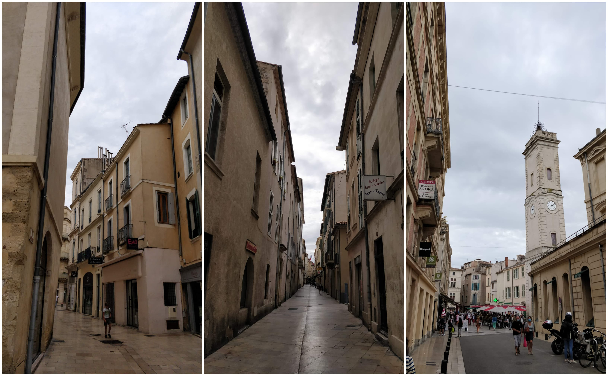

A month ago we drove ahead to the French Alps and visited Lyon, Chamonix Mont-Blanc, and Turin. We were not sure if we would be able to do this trip given the current COVID situation, so we booked accommodations a week before. In the end, everything went fine though we had to adapt to the _new normality_ rules like wearing a mask and keeping one's distance.

This is just a summary of the trip and the places we visited to help anyone who is planning a similar trip as well as to improve my knowledge about them and remember the incredible moments lived when reading it in the future.

## Table of contents
   - fjweew
   - fwefwe
   - efwfewf
## Nimes

We first headed to Lyon and on the way stopped to visit Nimes. We hadn't planned to go there, in fact, we like to **let some decisions be made on the go**, and when we were hungry enough to have lunch Nimes was the closest city big enough to worth paying a visit.  

The most remarkable thing about Nimes is the Roman monuments that it preserves and the good condition they are. The two most notable are the Amphitheater and the _Maison Carrée_, a temple.

The city center was pleasant thanks to the fact that cars aren't allowed to access.

One thing that caught my attention was a curious symbol found throughout the city, a crocodile next to a palm tree. Researching a little on my phone I found a post where its meaning was explained. In my humble opinion, **nowadays, he who doesn't learn something, it's due to lack of either motivation or internet access. **

Apparently it was the emblem of the city, where the palm tree is an old Roman symbol for victory, while the crocodile represents Egypt. The emblem dates back to 1535 when it was awarded to Nîmes as a new coat of arms to replace the old one, a bull on a red surface. The design comes from an old Roman coin, _l’as de Nîmes_, which was minted to commemorate a Roman Victory in Egypt. There are more details on [the original post.](https://nimesnotes.wordpress.com/2013/09/04/emblem-of-nimes/)

