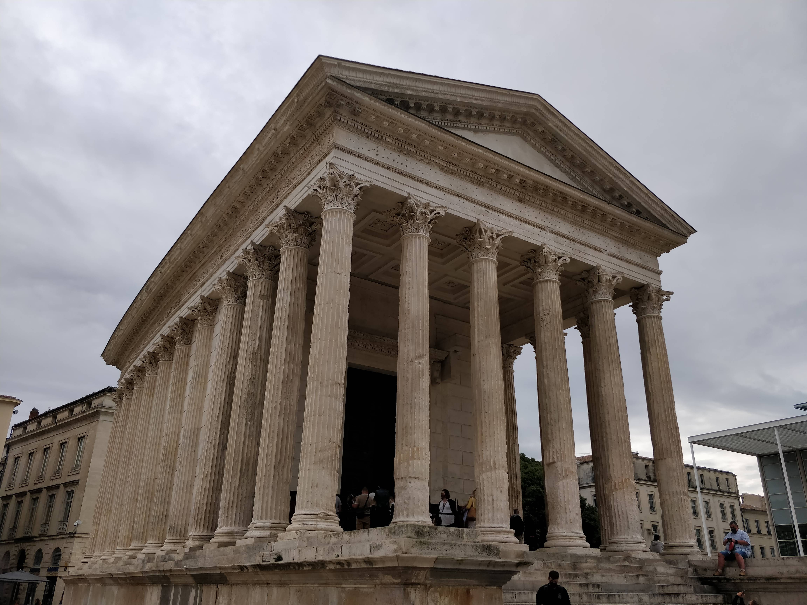
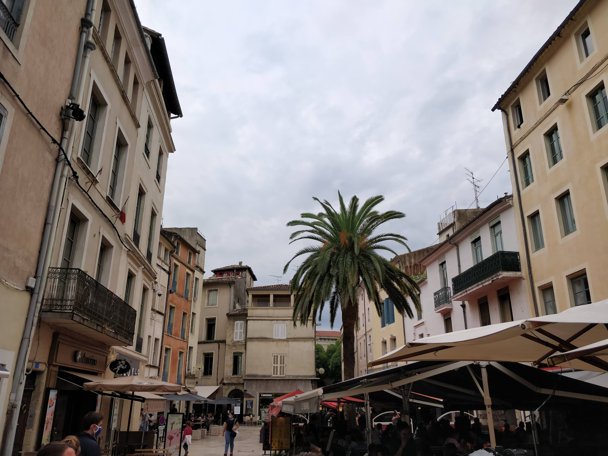
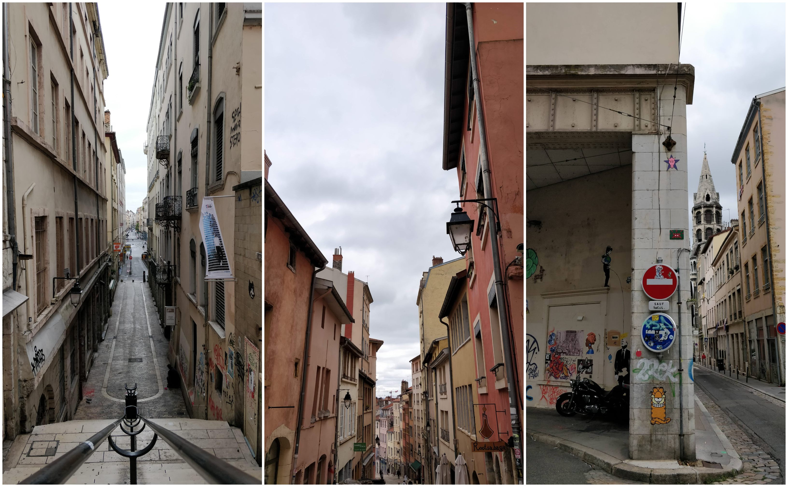
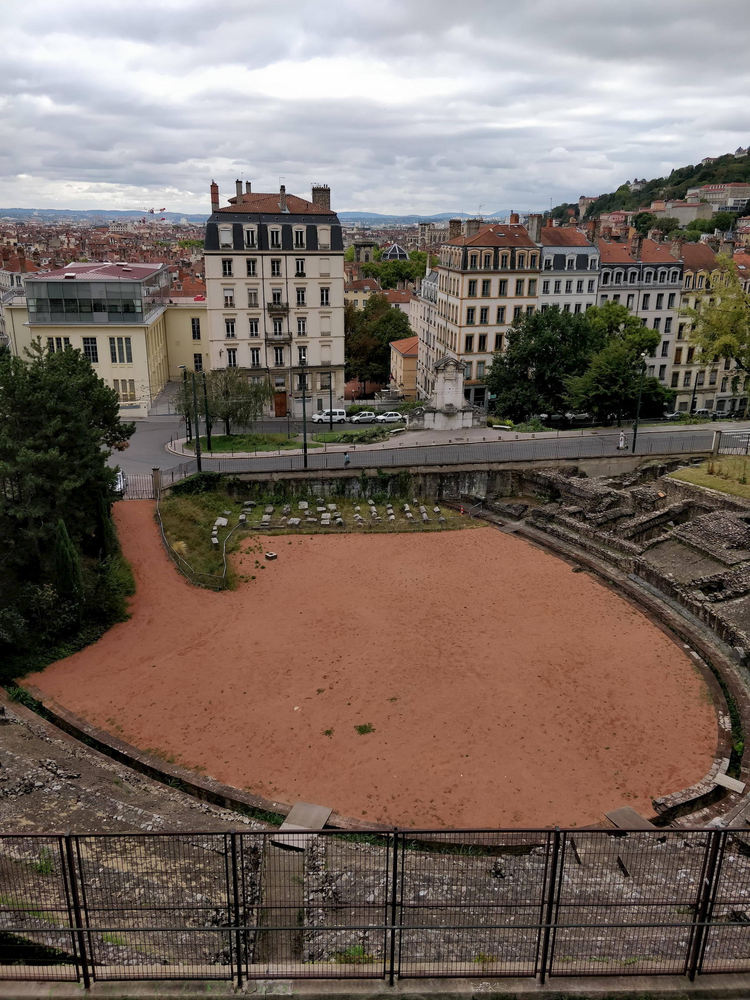
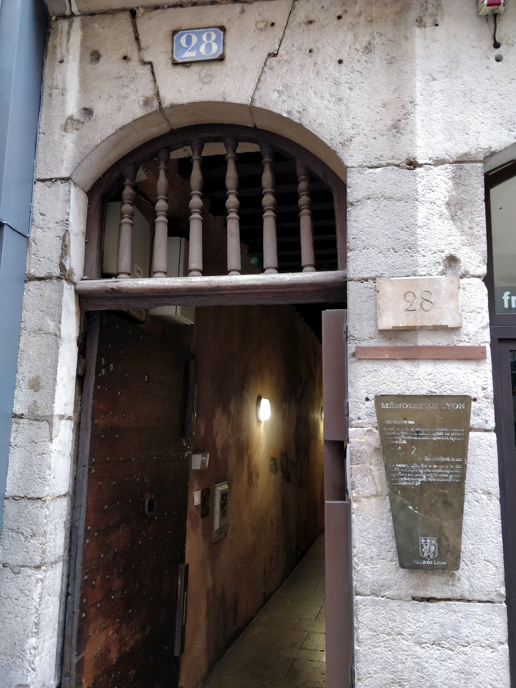
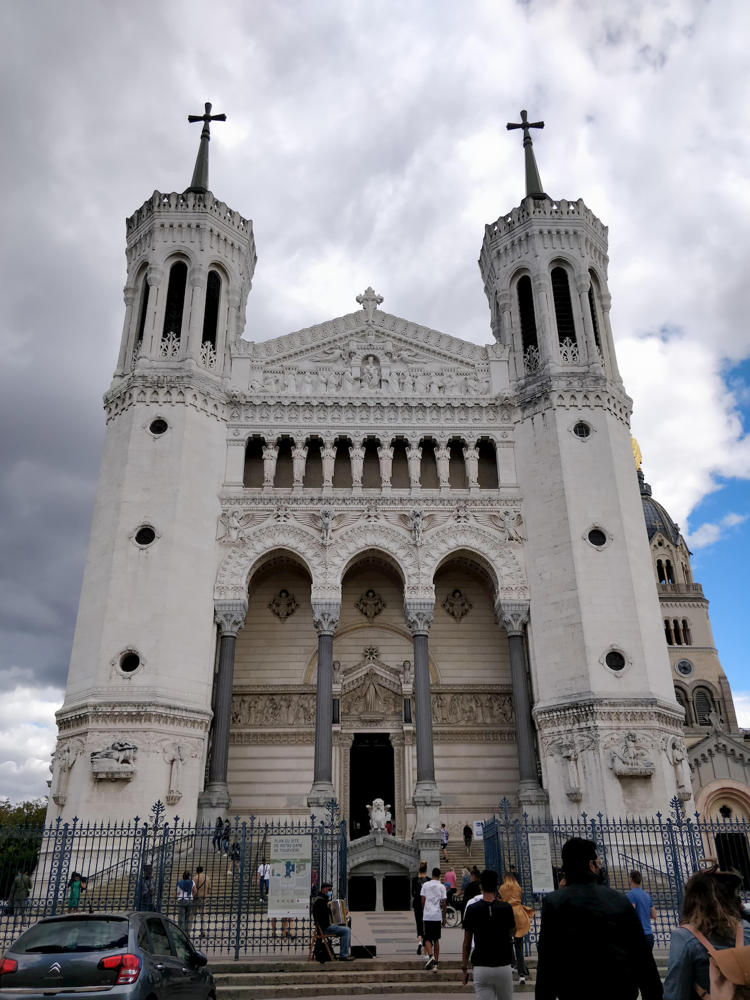
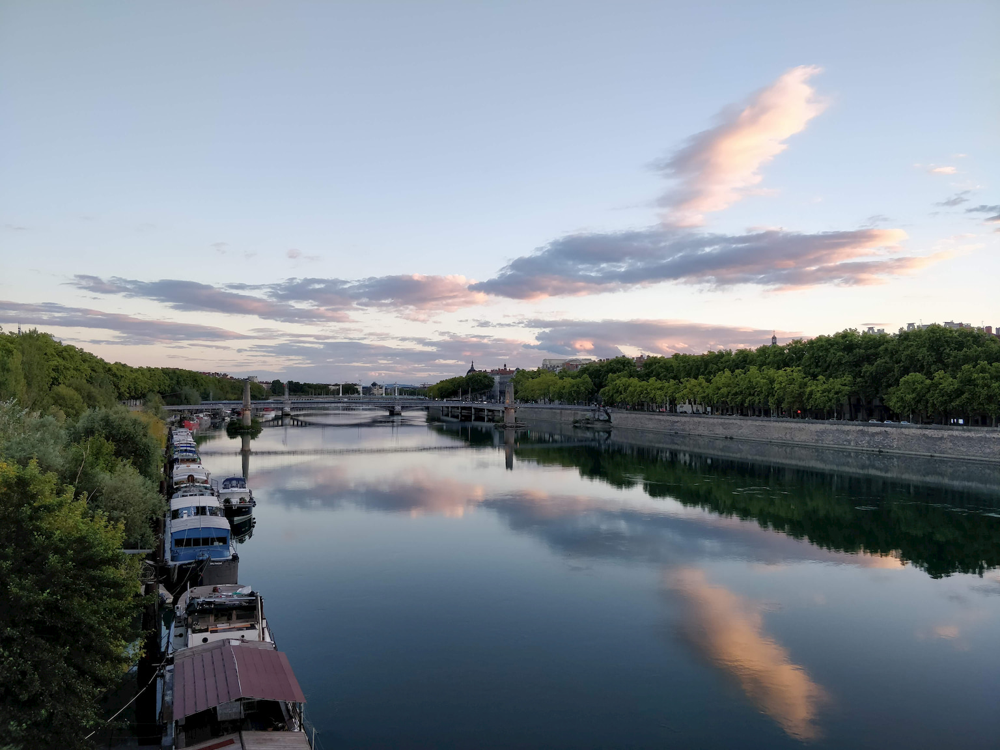
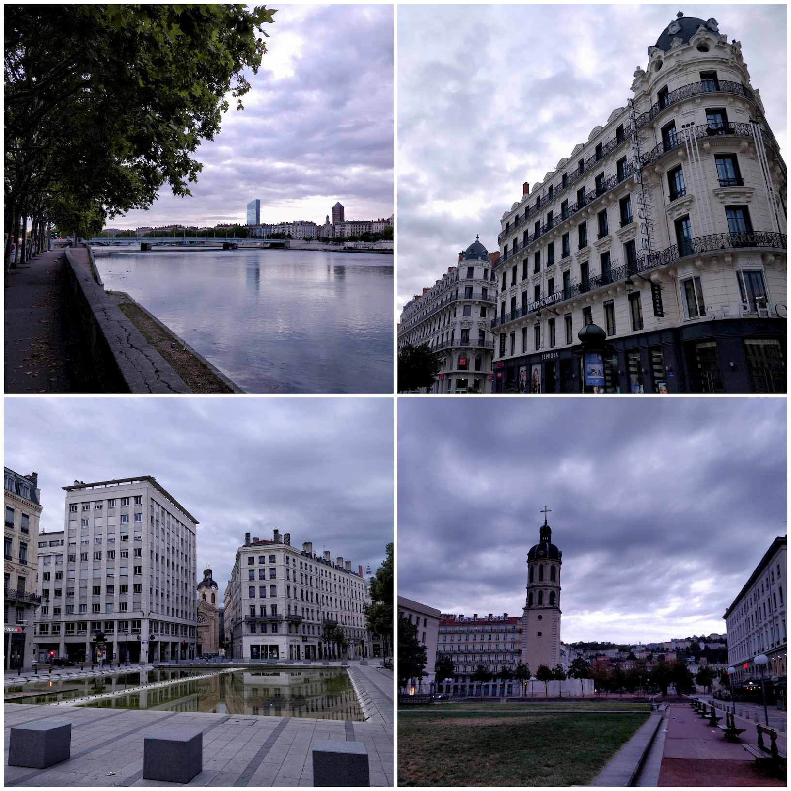

A month ago we drove ahead to the French Alps and visited Lyon, Chamonix Mont-Blanc, and Turin. We were not sure if we would be able to do this trip given the current COVID situation, so we booked accommodations a week before. In the end, everything went fine though we had to adapt to the _new normality_ rules like wearing a mask and keeping one's distance.

This is just a summary of the trip and the places we visited to help anyone who is planning a similar trip as well as to improve my knowledge about them and remember the incredible moments lived when reading it in the future.

## Table of contents
   - fjweew
   - fwefwe
   - efwfewf
   
## Nimes

We first headed to Lyon and on the way stopped to visit Nimes. We hadn't planned to go there, in fact, we like to **let some decisions be made on the go**, and when we were hungry enough to have lunch Nimes was the closest city big enough to worth paying a visit.  

The most remarkable thing about Nimes is the Roman monuments that it preserves and the good condition they are. The two most notable are the Amphitheater and the _Maison Carrée_, a temple.

The city center was pleasant thanks to the fact that cars aren't allowed to access.

One thing that caught my attention was a curious symbol found throughout the city, a crocodile next to a palm tree. Researching a little on my phone I found a post where its meaning was explained. In my humble opinion, **nowadays, he who doesn't learn something, it's due to lack of either motivation or internet access. **

Apparently it was the emblem of the city, where the palm tree is an old Roman symbol for victory, while the crocodile represents Egypt. The emblem dates back to 1535 when it was awarded to Nîmes as a new coat of arms to replace the old one, a bull on a red surface. The design comes from an old Roman coin, _l’as de Nîmes_, which was minted to commemorate a Roman Victory in Egypt. There are more details on [the original post.](https://nimesnotes.wordpress.com/2013/09/04/emblem-of-nimes/)

## Lyon

We spent just a day and a half here where we attended a free tour I had booked days before. After some years of traveling, it has become a habit for me to check for them whenever I visit a new location. I think It's **one of the best ways to discover a city’s history, culture, gastronomy, and daily life** there. From my experiences I can say that most guides are usually locals and take it seriously, even giving you **tips about unknown but worth it places to eat or visit** once the tour has finished. In case they don't, just ask them when the tour has finished. I encourage you **not to be ashamed and waste the chance to ask any question that occurs to you during the tour.**

However, the thing I like the most is the knowledge you get from them, so when I wander its streets later and something catches my attention, I recognize better what it is. And of course if I want to eat something in the area, I have a better idea of which are the local products.

I booked it on [here,](https://www.freetourlyon.com/) Paul was one of the best guides I have ever had and all the reviews from the tour you can find on its site or TripAdvisor are pretty accurate. The tour was all we could expect and more so do not hesitate to book it if you plan to visit Lyon. 

This time, unlike others, I decided to take some notes along the tour in order to remember the details better or just check them later if I had the need to. Therefore, this part will be a summary of Paul’s awesome tour. By the way, here is a map of Lyon’s downtown, so you can interpret it better.

](./lyon_downtown_map.jpg)

Lyon sits at the junction of the _Rhône_ and _Saône_ rivers, the 3 main districts of its city center are the _Vieux (Old) Lyon,_ the _Presqu'île peninsula_ and _La Croix-Rousse hill._ This is the best map I could find that represents them:

*   the Vieux (Old) Lyon - Yellow, Left
*   La Croix-Rousse hill - Orange, Top
*   Presqu'île peninsula - White, Bottom-Left

](./lyon_downtown_main_districts.jpg)

Paul told us as Paris is getting bigger and more expensive people are moving here for its high quality of life. The tour started on the Square from the _Hotel le Ville,_ Town Hall in French,  which had a fountain made by the same artist who made New York’s Liberty Statue.

We then headed to La Croix-Rousse hill. Lyon in the past was the Epicentre of Europe’s Silk Industry and this neighbourhood was a weaving reference for decades commonly done on buildings' basements. There were plenty of _Jacquard machines_, a device fitted to a loom that simplified the process of manufacturing using punched cards. 

](./wooden_jacquard_loom.jpg)

This machine was an important step in the history of computing hardware, and it's considered the first precursor of the modern-day computer. Actually, his inventor, Joseph Marie Jacquard was born in Lyon too, I was kindly surprised to find such a strong historic relationship between this city and the world of software.

There is one peculiarity from Lyon’s urbanism which makes it unique, its _Traboules_, covered passageways between buildings, and their courtyards that are found along La Croix-Rousse hill and Vieux Lyon. The word comes from an old Lyoness dialect and means “to go through”. Paul guided us through some of them and explained that most of them have signs to advise pedestrians to access them and take a shortcut. In La Croix-Rousse hill these are small squares unlike the bigger and brown ones in Vieux Lyon.

Besides, Lyon is the capital of French Gastronomy and cuisine. Paul Bocuse, a chef known as the "Pope" of French cuisine lived here. The _Andouillette_ (a sausage of coarsely cut tripe) is the most traditional dish, I tried it hours later and agreed with Paul that there won't be a second one.

](./andouillette.jpg)

Paul mentioned a tradition still done nowadays in some restaurants where a couple is given two menus, but the one for the woman had no prices on it, so the man is expected to pay for the meal. He called this tradition, or at least I noted the name as, _Service a la Francese,_ however, after some researching about it I found it had a different meaning related to the order the dishes are served; Service a la Francese stands for having all dishes served at the same time, buffet way, and the opposite is called _Service à la Russe_ in which dishes are brought to the table sequentially. 

Regarding its past,** Lyon was an important Roman city back in the day, the second one after Rome** actually. Julius Caesar conquered the Godus here and, after his death, they arose back with no victory although Romans ended afraid enough to move themselves to the top of the Vieux Lyon hill, a fact very uncommon given that they always built their cities in the valleys. This choice required aqueducts to be built in order to move the water up there.

We then passed by the _Roman Amphithéâtre des Trois Gaules_. Here is where I realized, thanks to Paul, about the meaning of the term amphitheater which derives from the ancient Greek _amphi_, meaning "on both sides" or "around" and _théātron_, meaning "place for viewing".  Both ancient Greek and ancient Roman theatres were built as a semicircle then an amphitheatre simply means two theatres. A theatre was a place to see plays and when they coupled another one it resulted in an arena for fighting. Despite fighting lions was the main attraction for citizens, when they ran out of them gladiators began fighting bulls, giving birth to the nowadays Spanish tradition.

Before crossing the Saône river to get to Vieux Lyon we stepped in front of a building whose facade had been covered by a _fresque_. Paul then told us about this odd practice found in 50 buildings hidden along with the city. The one we had in front of us featured some of the most famous characters in French culture such as _The Little Prince_, _The Lumière brothers_, or _André-Marie Ampère._ 

Here is another mind-blowing fresque we saw later that day located in another street where the tour did not pass. 

The tour ended at Vieux Lyon, whose buildings remained luckily  undamaged (even after two world wars) from the 15th century, when important families from Spain and Europe resided there; _Saint-Jean-Baptiste Cathedral_ is the main structure.

Many French architects admired the Renaissance architecture from Italy like Florence's cathedral and started adding some of these new styles at their courtyards. To spot them, look for brown signs, most of them are accessible to tourists and citizens. 

If you have the chance, take a funicular to Vieux Lyon hill to visit _La Basilique Notre Dame de Fourvière_ and contemplate the views from there. 

You can also walk along the shores of the rivers, particularly the Rhône’s ones whose sidewalks are wider, and you can find boat bars moored.

The tour’s day morning I woke up early for a morning run around the city on my own. I do this frequently back at home, but I never did while traveling. I have to say It was totally worth it, seeing Lyon’s morning face, people setting up local markets or eating something after a long night of fun, it was the morning after Saturday's night and as Paul said Lyon is a lively city.

