A month ago we drove ahead to the French Alps and visited Lyon, Chamonix Mont-Blanc, and Turin. We were not sure if we would be able to do this trip given the current COVID situation, so we booked accommodations a week before. In the end, everything went fine though we had to adapt to the _new normality_ rules like wearing a mask and keeping one's distance.

This is just a summary of the trip and the places we visited to help anyone who is planning a similar trip as well as to improve my knowledge about them and remember the incredible moments lived when reading it in the future.

## Table of contents
   - fjweew
   - fwefwe
   - efwfewf
   
## Nimes

We first headed to Lyon and on the way stopped to visit Nimes. We hadn't planned to go there, in fact, we like to **let some decisions be made on the go**, and when we were hungry enough to have lunch Nimes was the closest city big enough to worth paying a visit.  

The most remarkable thing about Nimes is the Roman monuments that it preserves and the good condition they are. The two most notable are the Amphitheater and the _Maison Carrée_, a temple.

The city center was pleasant thanks to the fact that cars aren't allowed to access.

One thing that caught my attention was a curious symbol found throughout the city, a crocodile next to a palm tree. Researching a little on my phone I found a post where its meaning was explained. In my humble opinion, **nowadays, he who doesn't learn something, it's due to lack of either motivation or internet access. **

Apparently it was the emblem of the city, where the palm tree is an old Roman symbol for victory, while the crocodile represents Egypt. The emblem dates back to 1535 when it was awarded to Nîmes as a new coat of arms to replace the old one, a bull on a red surface. The design comes from an old Roman coin, _l’as de Nîmes_, which was minted to commemorate a Roman Victory in Egypt. There are more details on [the original post.](https://nimesnotes.wordpress.com/2013/09/04/emblem-of-nimes/)

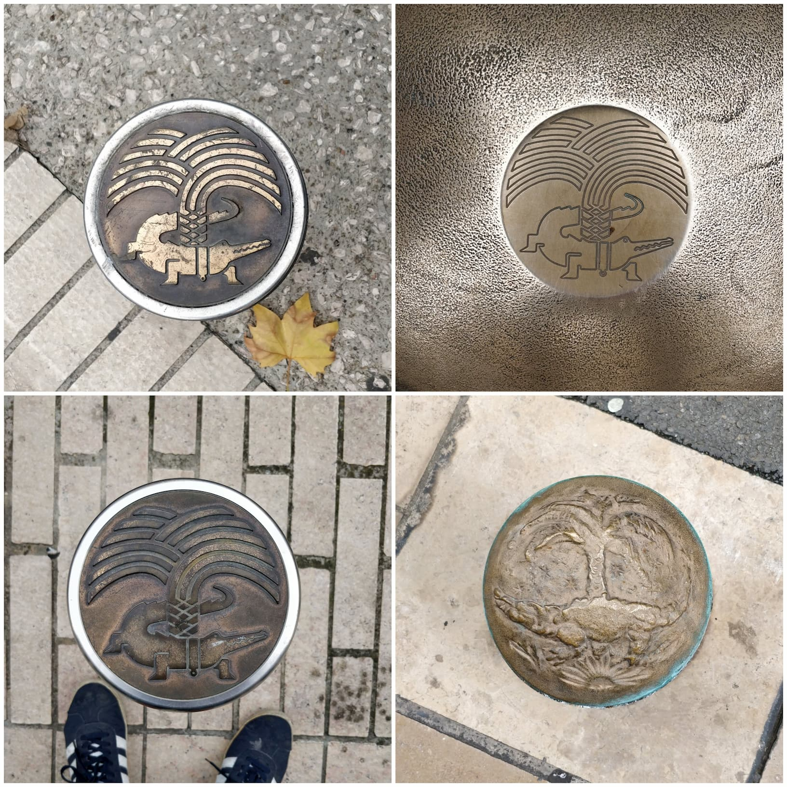

## Lyon

We spent just a day and a half here where we attended a free tour I had booked days before. After some years of traveling, it has become a habit for me to check for them whenever I visit a new location. I think It's **one of the best ways to discover a city’s history, culture, gastronomy, and daily life** there. From my experiences I can say that most guides are usually locals and take it seriously, even giving you **tips about unknown but worth it places to eat or visit** once the tour has finished. In case they don't, just ask them when the tour has finished. I encourage you **not to be ashamed and waste the chance to ask any question that occurs to you during the tour.**

However, the thing I like the most is the knowledge you get from them, so when I wander its streets later and something catches my attention, I recognize better what it is. And of course if I want to eat something in the area, I have a better idea of which are the local products.

I booked it on [here,](https://www.freetourlyon.com/) Paul was one of the best guides I have ever had and all the reviews from the tour you can find on its site or TripAdvisor are pretty accurate. The tour was all we could expect and more so do not hesitate to book it if you plan to visit Lyon. 

This time, unlike others, I decided to take some notes along the tour in order to remember the details better or just check them later if I had the need to. Therefore, this part will be a summary of Paul’s awesome tour. By the way, here is a map of Lyon’s downtown, so you can interpret it better.

](./lyon_downtown_map.jpg)

Lyon sits at the junction of the _Rhône_ and _Saône_ rivers, the 3 main districts of its city center are the _Vieux (Old) Lyon,_ the _Presqu'île peninsula_ and _La Croix-Rousse hill._ This is the best map I could find that represents them:

*   the Vieux (Old) Lyon - Yellow, Left
*   La Croix-Rousse hill - Orange, Top
*   Presqu'île peninsula - White, Bottom-Left

](./lyon_downtown_main_districts.jpg)

Paul told us as Paris is getting bigger and more expensive people are moving here for its high quality of life. The tour started on the Square from the _Hotel le Ville,_ Town Hall in French,  which had a fountain made by the same artist who made New York’s Liberty Statue.

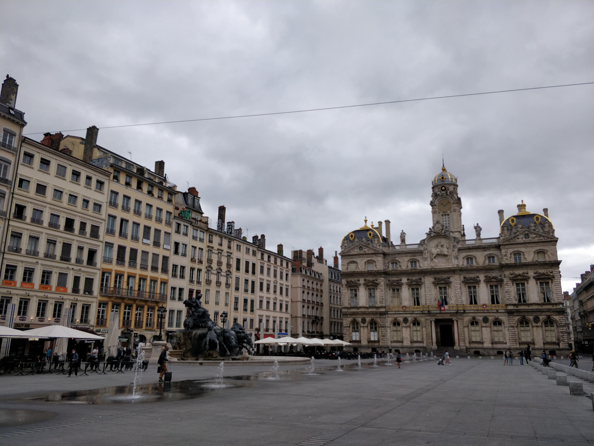

We then headed to La Croix-Rousse hill. Lyon in the past was the Epicentre of Europe’s Silk Industry and this neighbourhood was a weaving reference for decades commonly done on buildings' basements. There were plenty of _Jacquard machines_, a device fitted to a loom that simplified the process of manufacturing using punched cards. 

](./wooden_jacquard_loom.jpg)

This machine was an important step in the history of computing hardware, and it's considered the first precursor of the modern-day computer. Actually, his inventor, Joseph Marie Jacquard was born in Lyon too, I was kindly surprised to find such a strong historic relationship between this city and the world of software.

There is one peculiarity from Lyon’s urbanism which makes it unique, its _Traboules_, covered passageways between buildings, and their courtyards that are found along La Croix-Rousse hill and Vieux Lyon. The word comes from an old Lyoness dialect and means “to go through”. Paul guided us through some of them and explained that most of them have signs to advise pedestrians to access them and take a shortcut. In La Croix-Rousse hill these are small squares unlike the bigger and brown ones in Vieux Lyon.

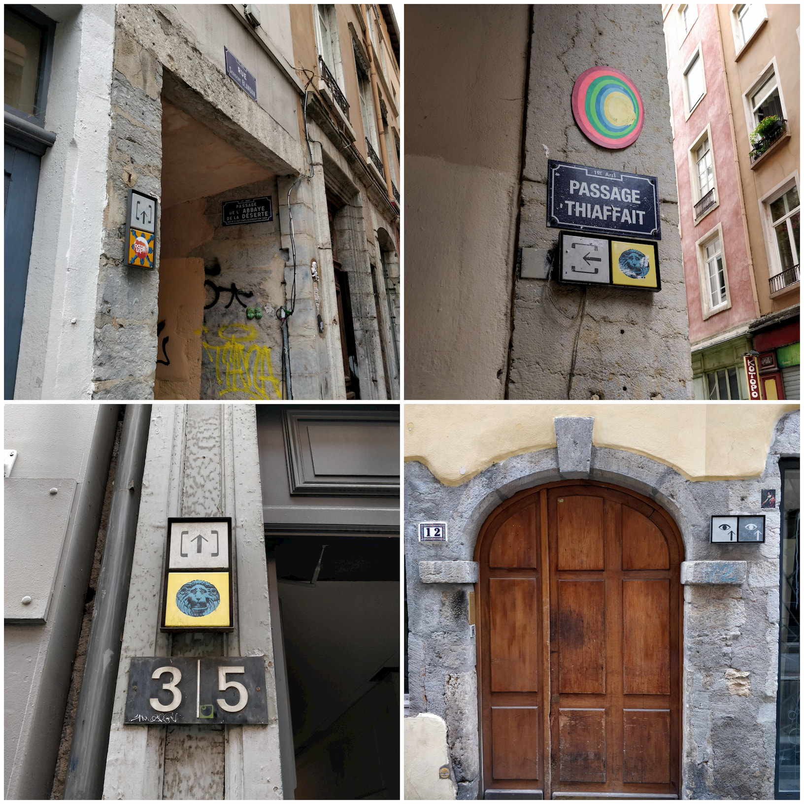

Besides, Lyon is the capital of French Gastronomy and cuisine. Paul Bocuse, a chef known as the "Pope" of French cuisine lived here. The _Andouillette_ (a sausage of coarsely cut tripe) is the most traditional dish, I tried it hours later and agreed with Paul that there won't be a second one.

](./andouillette.jpg)

Paul mentioned a tradition still done nowadays in some restaurants where a couple is given two menus, but the one for the woman had no prices on it, so the man is expected to pay for the meal. He called this tradition, or at least I noted the name as, _Service a la Francese,_ however, after some researching about it I found it had a different meaning related to the order the dishes are served; Service a la Francese stands for having all dishes served at the same time, buffet way, and the opposite is called _Service à la Russe_ in which dishes are brought to the table sequentially. 

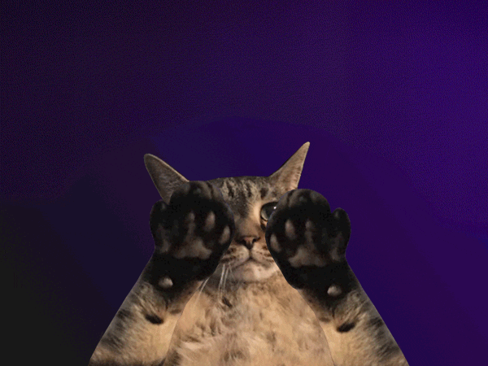

Regarding its past,** Lyon was an important Roman city back in the day, the second one after Rome** actually. Julius Caesar conquered the Godus here and, after his death, they arose back with no victory although Romans ended afraid enough to move themselves to the top of the Vieux Lyon hill, a fact very uncommon given that they always built their cities in the valleys. This choice required aqueducts to be built in order to move the water up there.

We then passed by the _Roman Amphithéâtre des Trois Gaules_. Here is where I realized, thanks to Paul, about the meaning of the term amphitheater which derives from the ancient Greek _amphi_, meaning "on both sides" or "around" and _théātron_, meaning "place for viewing".  Both ancient Greek and ancient Roman theatres were built as a semicircle then an amphitheatre simply means two theatres. A theatre was a place to see plays and when they coupled another one it resulted in an arena for fighting. Despite fighting lions was the main attraction for citizens, when they ran out of them gladiators began fighting bulls, giving birth to the nowadays Spanish tradition.

Before crossing the Saône river to get to Vieux Lyon we stepped in front of a building whose facade had been covered by a _fresque_. Paul then told us about this odd practice found in 50 buildings hidden along with the city. The one we had in front of us featured some of the most famous characters in French culture such as _The Little Prince_, _The Lumière brothers_, or _André-Marie Ampère._ 

Here is another mind-blowing fresque we saw later that day located in another street where the tour did not pass. 

The tour ended at Vieux Lyon, whose buildings remained luckily  undamaged (even after two world wars) from the 15th century, when important families from Spain and Europe resided there; _Saint-Jean-Baptiste Cathedral_ is the main structure.

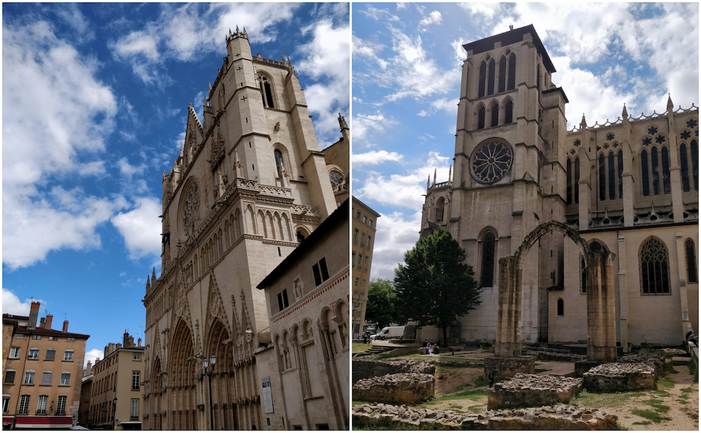

Many French architects admired the Renaissance architecture from Italy like Florence's cathedral and started adding some of these new styles at their courtyards. To spot them, look for brown signs, most of them are accessible to tourists and citizens. 

If you have the chance, take a funicular to Vieux Lyon hill to visit _La Basilique Notre Dame de Fourvière_ and contemplate the views from there. 

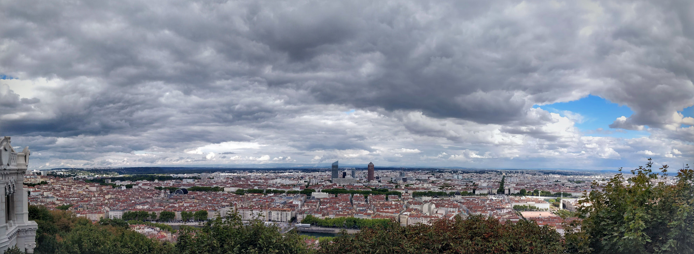

You can also walk along the shores of the rivers, particularly the Rhône’s ones whose sidewalks are wider, and you can find boat bars moored.

The tour’s day morning I woke up early for a morning run around the city on my own. I do this frequently back at home, but I never did while traveling. I have to say It was totally worth it, seeing Lyon’s morning face, people setting up local markets or eating something after a long night of fun, it was the morning after Saturday's night and as Paul said Lyon is a lively city.

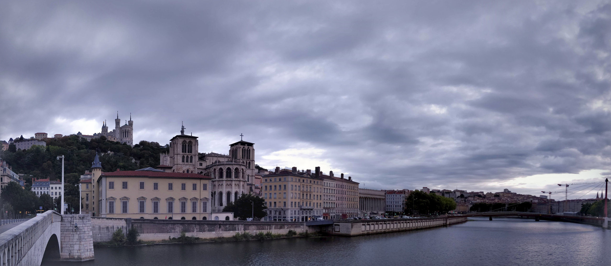

## Chamonix - Mont Blanc

Once done with Lyon we spent the next few days in Chamonix - Mont blanc, a town renowned for its skiing near the junction of France, Switzerland and Italy, at the base of **Mont Blanc (4,808 m), the highest summit in the Alps.**

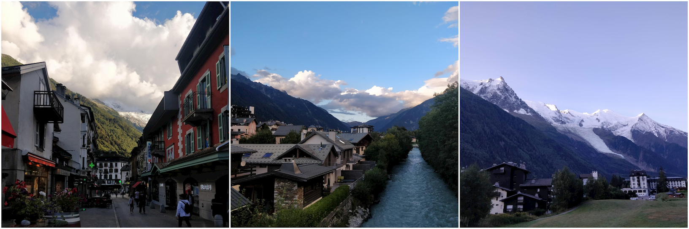

There are cable cars that take visitors up to several nearby peaks with panoramic views, including _Aiguille du Midi,_ _Pointe Helbronner,_ and a rack railway to the _Mer de Glace_ vast glacier. Besides, beautiful treks are nearby the town, just like in Lyon, some mornings and afternoons I went to run. Some mornings the fog was so dense you couldn't see far away and was hard to position yourself.

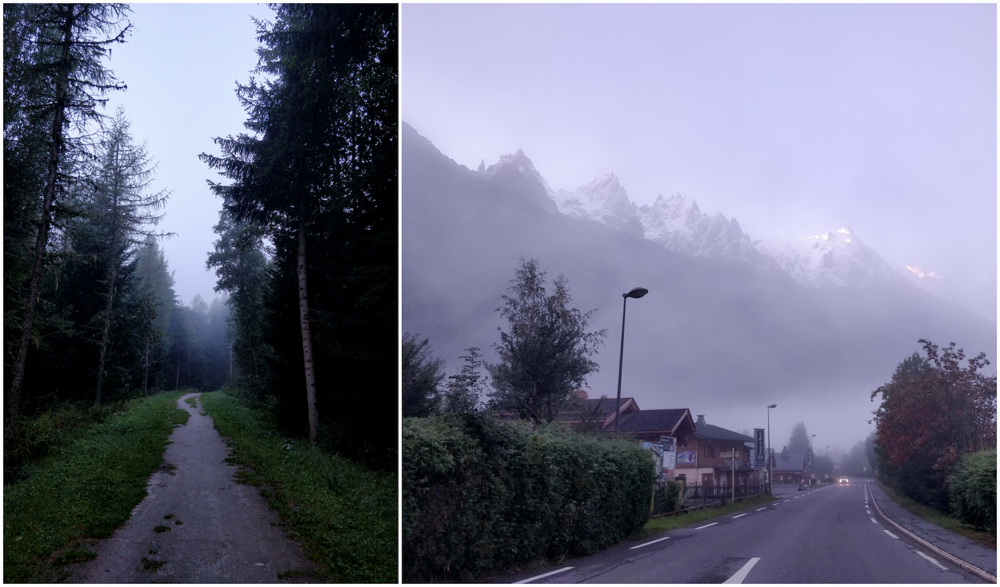

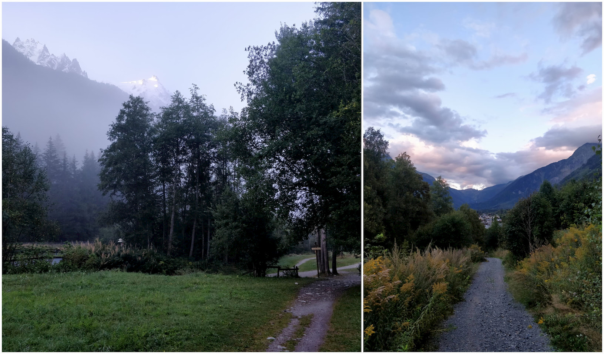

### Aiguille du Midi

The Aiguille du Midi is a 3,842-metre-tall mountain, you had to take a cable car from Chamonix to get up there. 

`video: title: "Going up in the cable car": ./going_up_in_the_cable_car.mp4`

The summit station is bigger than I thought indeed. You can easily spend the morning or even half day here, and the spots it offers.

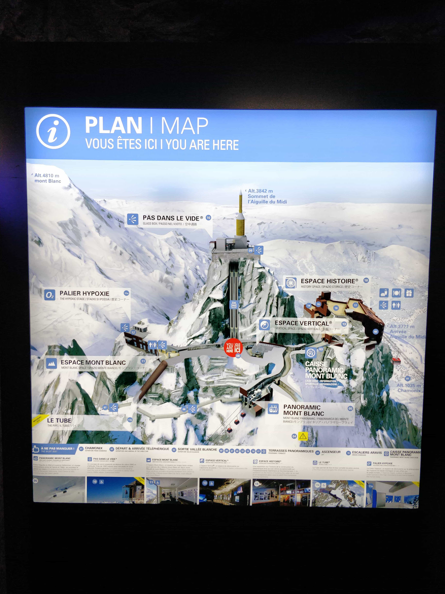

Undoubtedly the best thing are the astonishing views of the Alps. I could have spent gladly all day contemplating them.

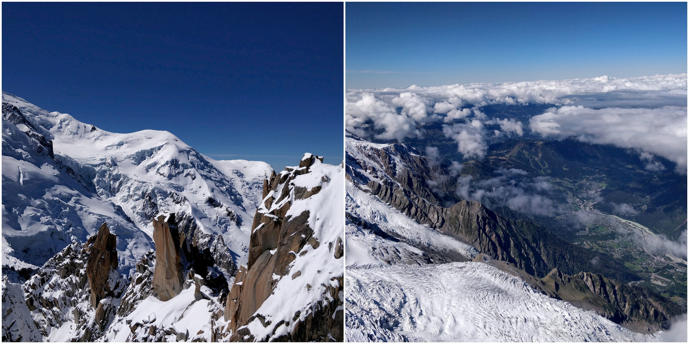

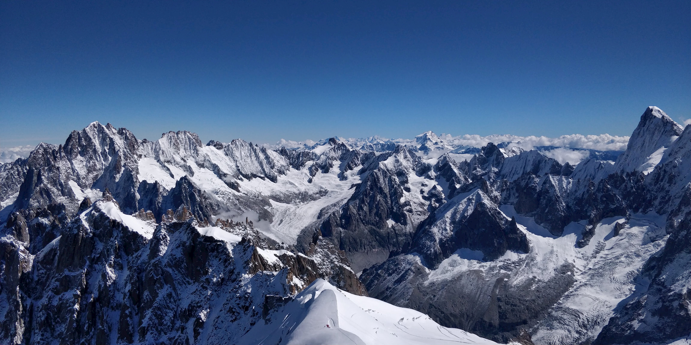

### Gorges of the Diosaz

Another place we were encouraged to visit at the tourist info office was the _Gorges of the Diosaz,_ a suspended path in a valley near Chamonix. The path followed the river's flow up and its waterfalls.

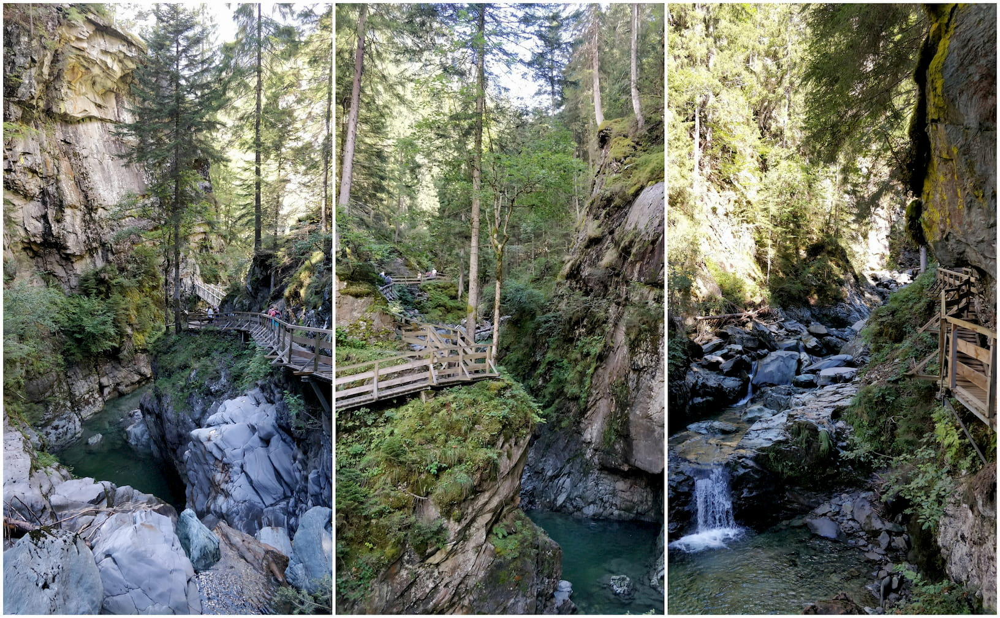

### Mer De Glace

The last spot we reached in Chamonix valley was the _Mer De Glace_ ("Sea of Ice"), a valley glacier located on the northern slopes of the Mont Blanc massif, It is 7.5 km and can be regarded as **the longest and largest glacier in France.** To arrive a rack railway has to be taken from Chamonix. The train leaves you on the glacier station from where you can contemplate the glacier flowing through the valley.

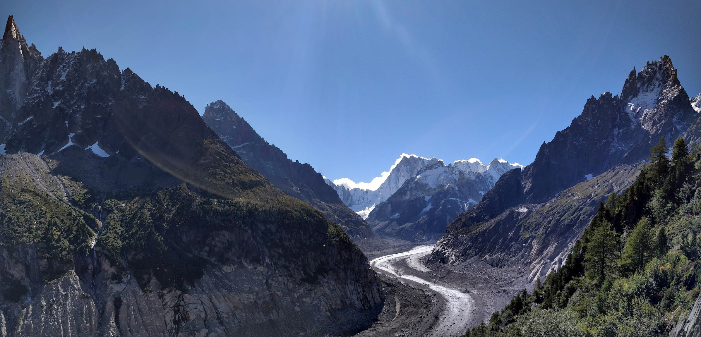

The main attraction was getting inside the glacier. While descending the stairs you could see on the rock wall measures of the glacier level through the years which had worryingly decreased the last decades.

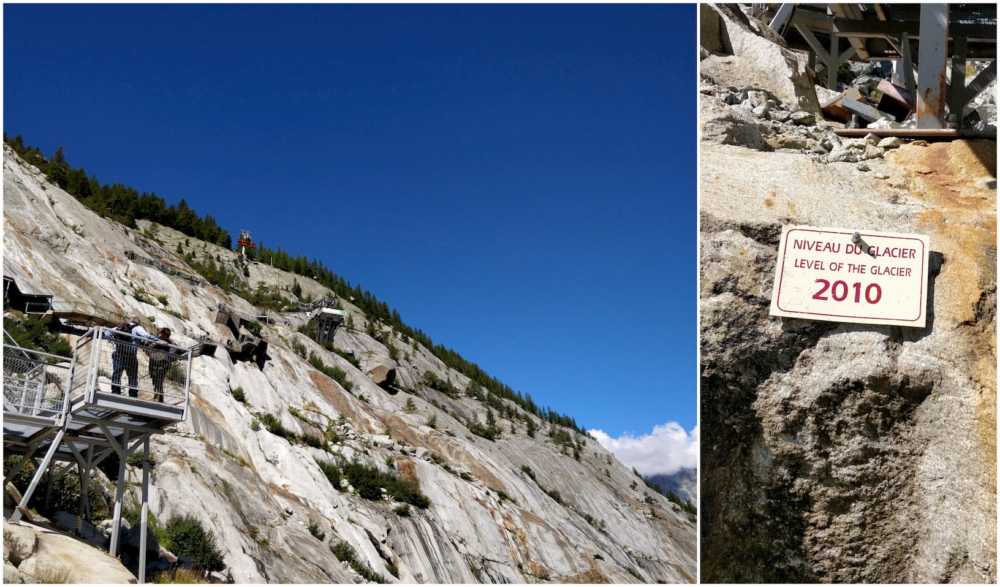

> Recently, climate change has dramatically impacted the Mer De Glace glacier. The glacier has retreated more than 1000 meters since 1870, and the surface has dropped approximately 100 meters since its position was measured in 1909. **If the history of Mer De Glace’s retreat appears dramatic, its future looks apocalyptic.** A recent study demonstrated the Mer De Glace glacier is expected to retreat another 1200 meters between now and 2040. With a significant acceleration of the melt rate occurring, **this may be the last century to see the Mer De Glace.**
> — [GlacierHub 2018](https://glacierhub.org/2018/12/27/sensing-the-divine-frankensteins-creature-and-the-mer-de-glace/)

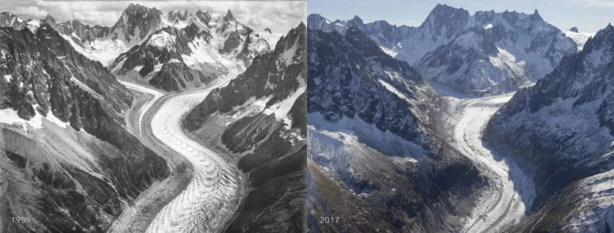

Once you reached the glacier level you were able to access it. I had never been inside a glacier before and it surprised me that even though you are literally inside of ice, it is not as chill as it seems to be at first thought. 

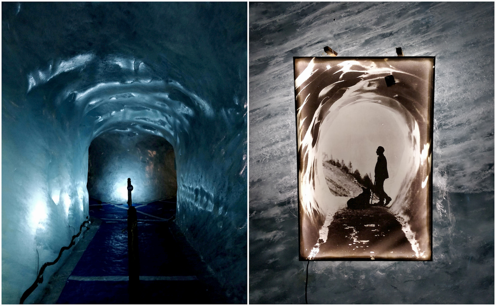

## Turin

The first time we planned this trip we were going to pass through and stay in Turin on our way to Chamonix. It was the COVID-19 situation at the moment, and the consequent uncertainty of whether we could access italy without passing a control or having to quarantine which made us update the itinerary and choose Lyon instead. How glad I am that things turned out that way, Lyon pleasantly amazed me. 

Nonetheless, the desire of visiting Turin was still there, and we had some unplanned days on purpose so one of them we got up early and crossed the border. The shortest way to get to Turin from Chamonix was crossing the _Mont Blanc Tunnel_ (11.611 km), **the world's second deepest operational tunnel.**

`video: title: "Crossing the Mont Blanc Tunnel": ./crossing_the_mont_blanc_tunnel.mp4`

Keeping tradition, I booked a free tour for Turin. The tour was as great as our guide, Angelo, a local showed us every city detail. [Here is the site](https://www.freetourturin.com/) from which I booked it. I took some notes too from him so here goes a summary of them about Turin.

Turin is the capital city of Piedmont in northern Italy, the Alps rise to the northwest of it. Located next to river Po , stately baroque buildings and old cafes line its boulevards and grand squares. Here is a map of the city:

](./turin_city_map.jpg)

The name comes from its symbol, the bull, _Torino_ in Italian. Legend has it that when north tribes came to live here there was a dragon already, and they sent a bull to fight and defeat it. When Romans arrived and found the bull as the tribe’s totemic sign adopted it as the main emblem of the city.

Its main street, _Via Roma,_ was renovated by Mussolini in a fascist style in the 1930s. Some main shops and famous brands located along it still have the golden frame on the doors which symbolized luxury back then.

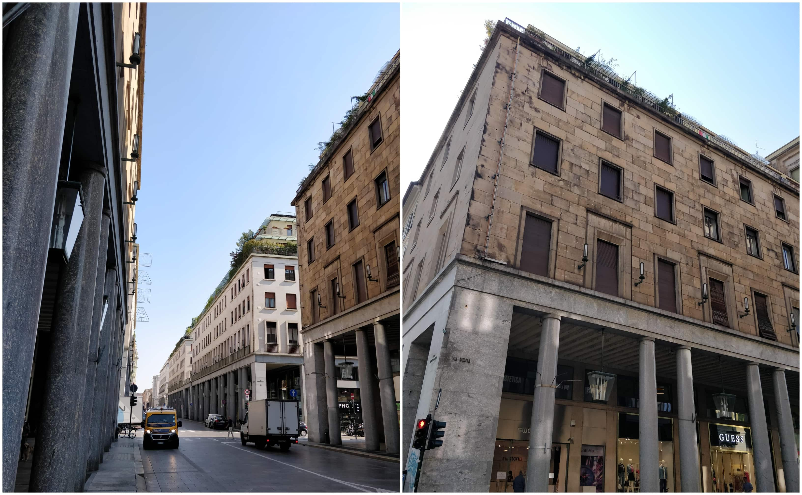

The first square found in Via Roma is the _CLN square,_ a monument against Mussolini. It was originally called the _Two fountains square,_ which represent the two rivers from Turin, _Po_ and _Dora Riparia._

The second one is the _Piazza San Carlo_ which has two churches addressed to different attendees in the past, poor people richer one. Surely decoration and ornaments are more abundant on the richer people’s one. 

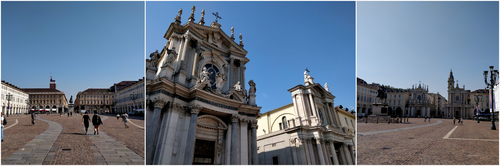

Back in the day, _the Savoy,_ was a powerful rich French family who wanted to enlarge their territories and took Turin’s region in the 16th century, becoming the new capital of their territory. When in the 19th century Italy united as a single nation its monarch was chosen from the Savoy family although they lasted until the second world war where Mussolini imposed its authority while they stayed in the background. When war was over, a referendum was made to choose between monarchy or Republic, and they were exiled when Republic was chosen.

One of these kings married a spanish princess from the royal family which gave him chocolate and coffee brought from America. Since then chocolate has become its food icon, being the _gianduiotto_ the most famous, made with hazelnuts, cocoa, and sugar. The well known brand Nutella is original from there. 

Coffee became popular too, the brand _Lavazza_ was from here as well. However, the most popular drink was the vermouth, made with wine and local herbs from the area. Adding more world-famous brands to the list _Martini_ was originated here too however the local oldest one is Carpano. 

Speaking of older times, there is a world-famous Egyptian museum in Turin for the unusual reason that the Savoy family won Napoleon soldiers when they were transporting Egyptian pieces and treasures. In addition, some buildings hold cannonballs from the Napoleon war on their facades; when rebuilding the city they added them like _a battle scar that symbolizes that they were stronger._

Downtown city’s style is mainly baroque nevertheless there is a medieval district preserving the old Roman planning. This civilization raised cities intersecting two main roads, called _cardo_ and _decumanus,_ then separated the city into quarters forming a big square known in Italy as _Quadrilateral Romano,_ this can be observed throughout Turin. _Via Garibaldi_ was the only street named differently in honor of Garibaldi, a popular hero.

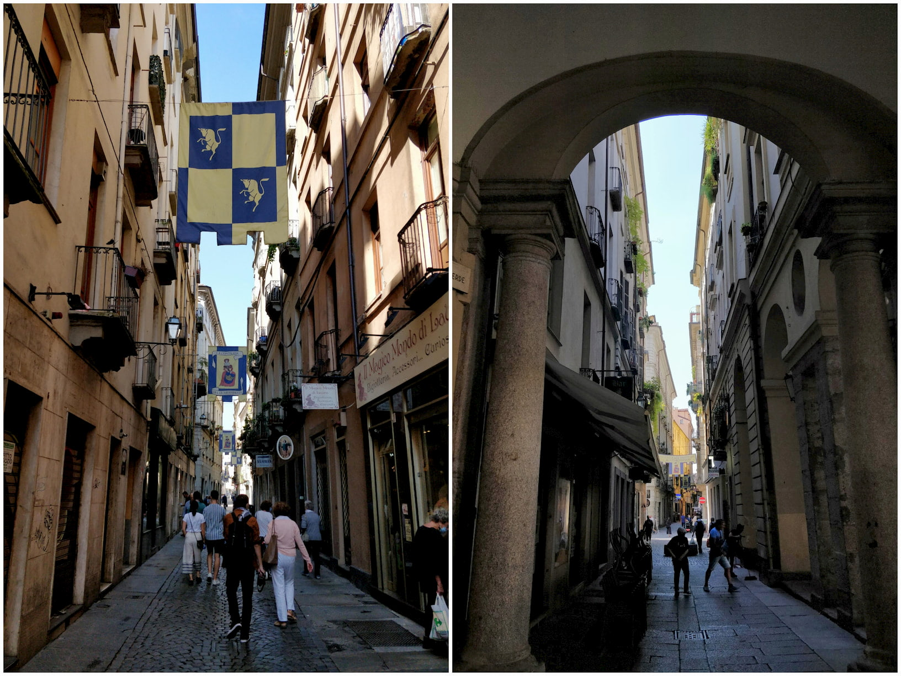

Having that square planning, cities had four gates yet only one has survived over the years, the _Porta Palatina_ which leads straight forward to Milan. Side towers were added in the middle age and if you wanted to access the city you had to pay a pass tax, a common practice in Roman cities. Named after Julius Caesar, Turin's original name was _Julia Taurinorum,_ then Augustus changed it to _Augusta Taurinorum._

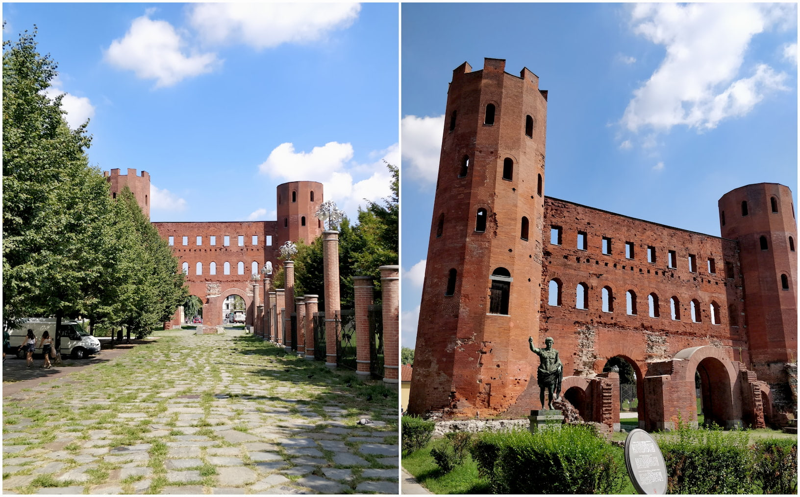

The _Piazza Castello_ is the central city point named after the medieval castle situated in the middle which was a Roman gate back in the day. However, the king wanted a baroque palace so architects built it on the front side becoming an unusual building half medieval castle half baroque palace.

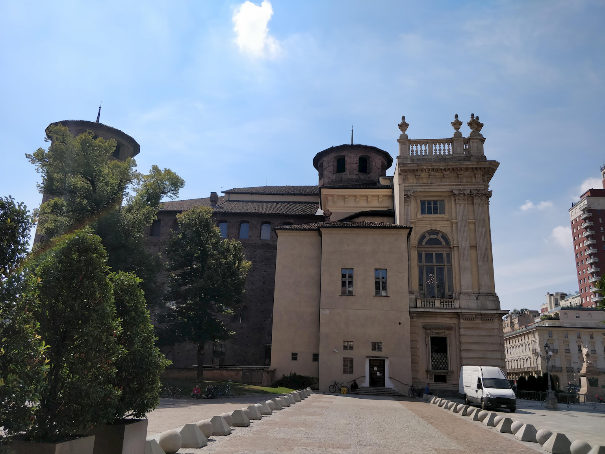

The Savoy family enjoyed having a similar style and height for buildings, so most of the important buildings do not stand out from the rest. There is only one high-rise building, the _Torre Littoria_ made for Mussolini’s National Fascist Party. Angelo told us **Turin citizens dislike it and call it Mussolini’s finger** for his semblance with the dictator’s hand pointing to the sky.

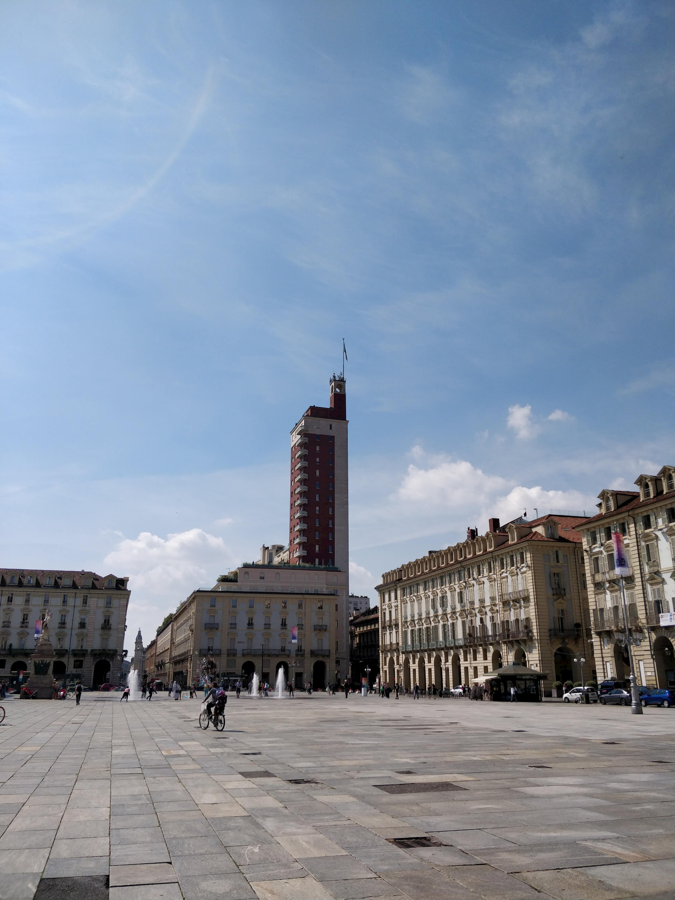

The last monumental building of the tour was _Mole Antonelliana,_ the tallest building in Italy and Europe until 1960 (167.5 meters). Originally conceived of as a synagogue, it now houses the National Museum of Cinema which is believed the tallest museum in the world.

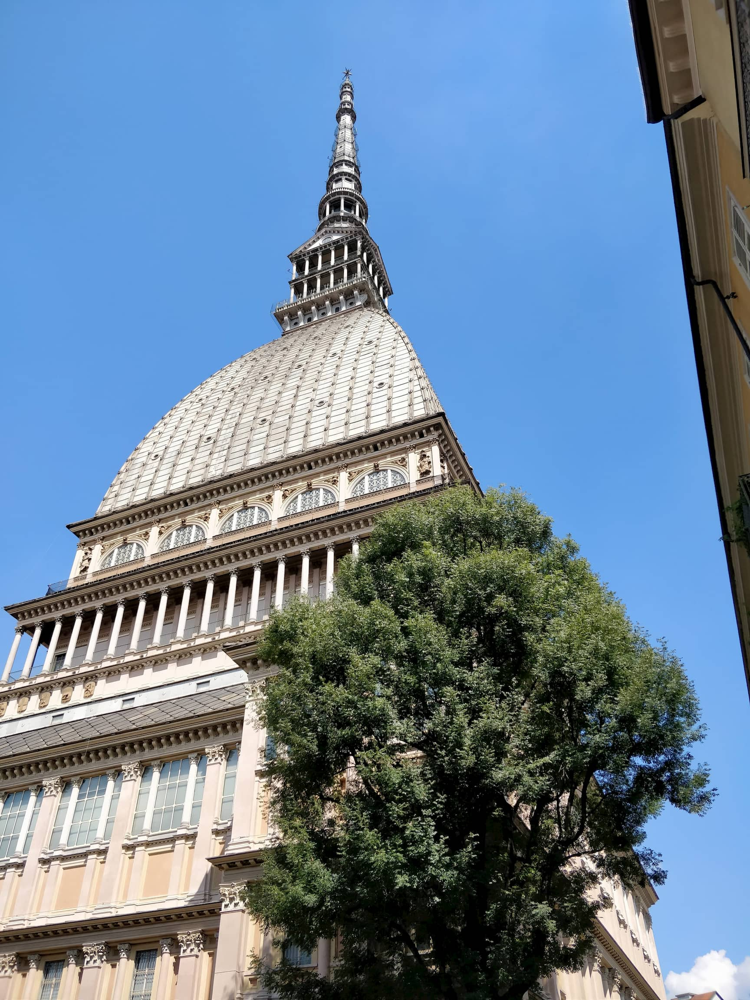

Other notes about Turin I pointed down:
- Yellow and blue are the main colors. 
- Is the second city with more arcades, about 18 km, being the first bologna with 38 km
- _Baci di dama_ (ladies kisses) are a typical sweet similar to macaroni but filled with _Gianduiotto._ 

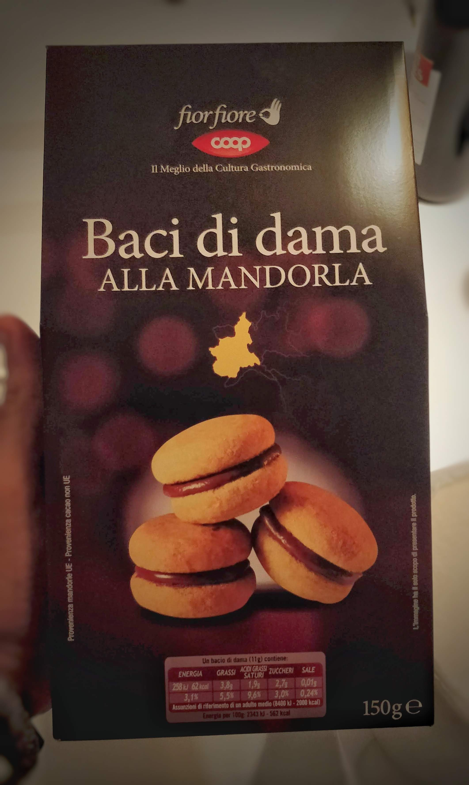

## Annecy

On the way back to Spain we stopped in _Annecy_ an alpine town in southeastern France, with a beautiful lake. Quite a lovely place to spend a day or half of it.

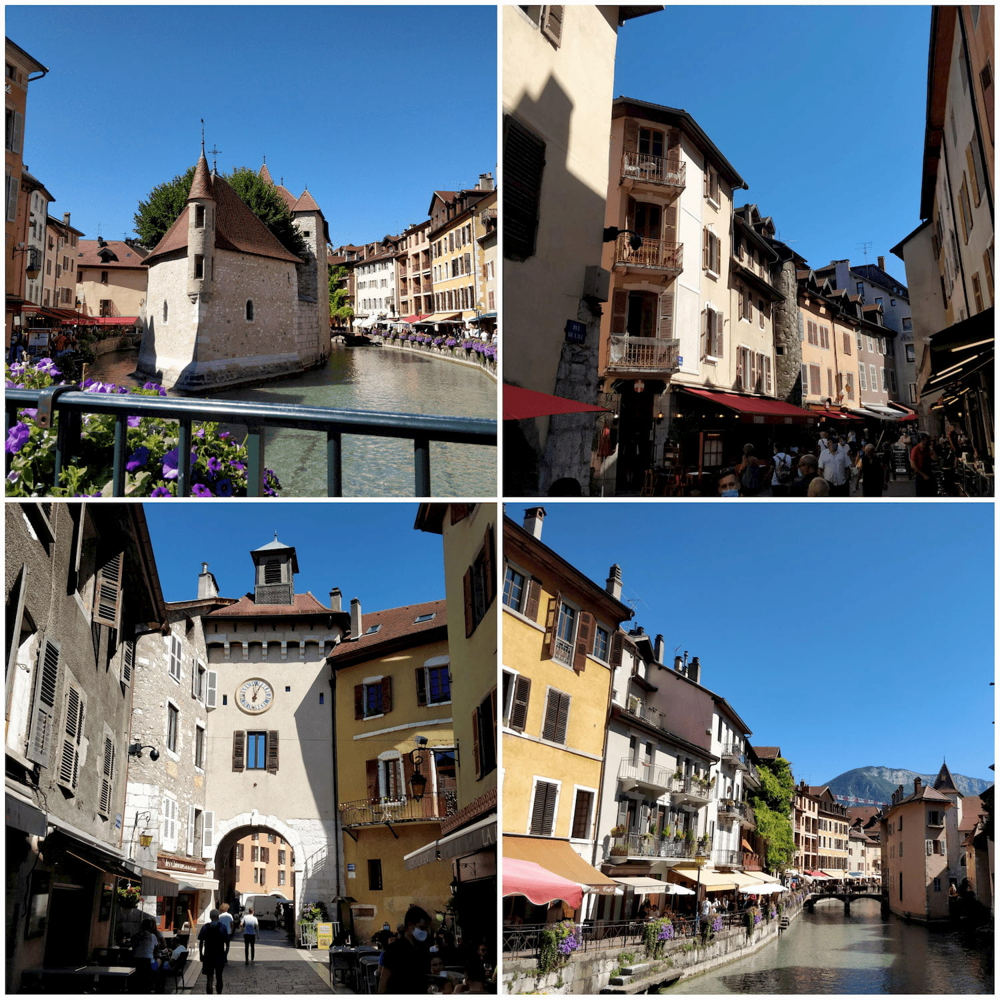

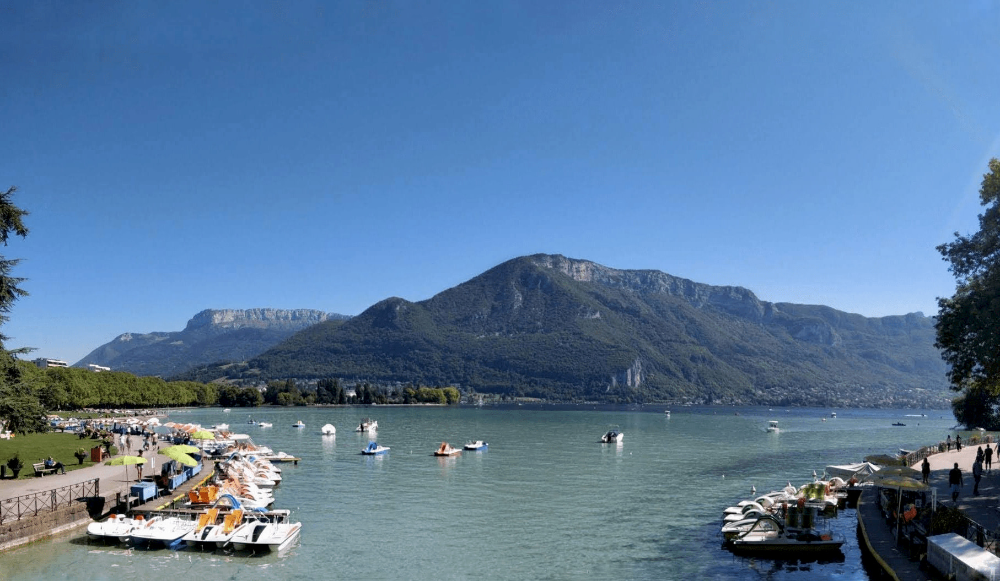

