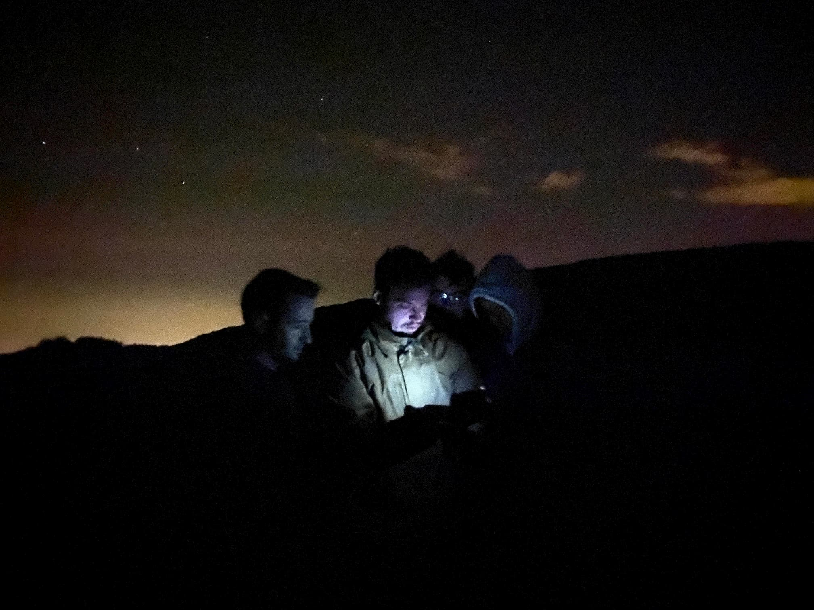

Some time ago I was living in the Canary Islands, a set of islands well-known for having one of the clearest skies in the world. Amazed by the stars’ views my housemates and me spent some nights stargazing.

Those were not my first nights contemplating the stars on a clear sky, but the fact of **capturing them contributed more to enjoy the moment.** I always thought this kind of activity was just for professional photographers but **after understanding some concepts even someone with no experience can enjoy it and take awesome pictures.** 

 Aperture ƒ/1.7, Shuter Speed 30s, ISO 2000](./the_milky_way_over_the_teide.jpg)

I will share what I learned so anyone can experience it too. Be advised that I am no professional photographer and that I will explain technical concepts in a _simpler_ way as this article is addressed to beginners.
   
## Table of Contents

- [The Location](#The-Location)
- [The Device](#the-Device)
- [The Exposure Triangle](#The-Exposure-Triangle)
    - [ISO](#ISO)
    - [Aperture](#Aperture)
    - [Shutter Speed](#Shutter-Speed)
- [Conclusions](#Conclusions)
- [Greetings](#Greetings)

## The Location

Nowadays **because of the cities’ light pollution, these are not the best places for this activity.** Therefore the further you are from them the better If you want to have a clearer sky. The [Bortle scale](https://en.wikipedia.org/wiki/Bortle_scale) is a nine-level numeric scale that measures the night sky's brightness.

.](./light_pollution_in_the_bortle_scale.jpg)

## The Device

**You don’t need an expensive camera, or a night mode one** to have fun and take decent pictures. The majority of phones have a mode that lets you adjust the settings for the shot. 

Remember to **have the device in a fixed position while taking the photo.** Don't even consider holding it with your hands. Although you don't need a tripod it will help you for this purpose.

## The Exposure Triangle

### ISO

### Aperture

### Shutter Speed

## Conclusions

## Greetings

