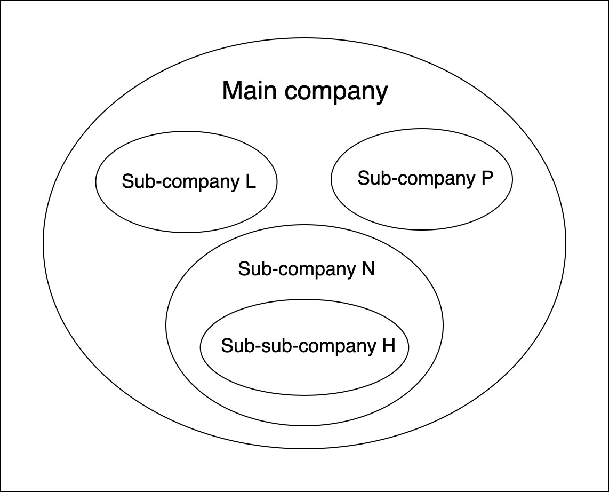
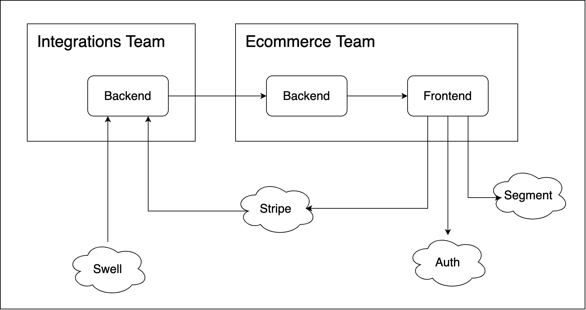
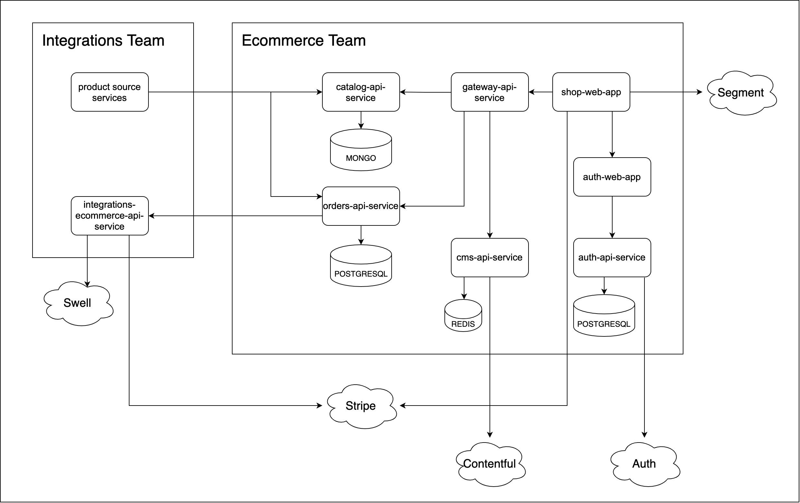
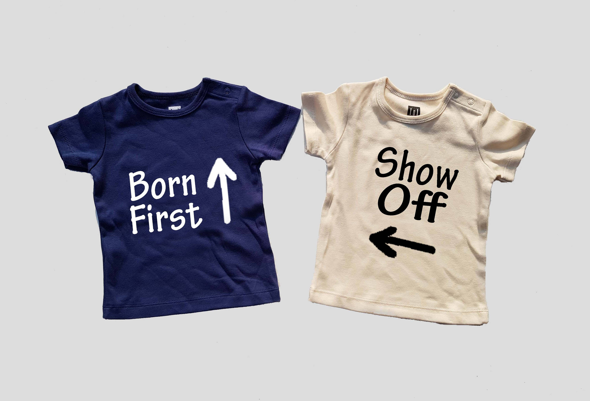
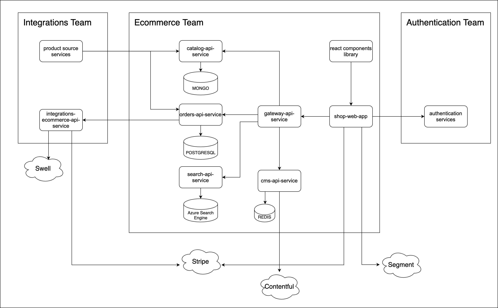
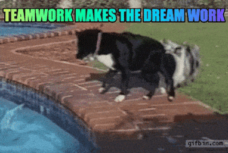

This is a story about my team's hard work developing not a single ecommerce platform, but a reusable one for different owners, keeping the same codebase, look and feel, but being highly customizable. I will conclude with what we learned from it which I believe can be a useful learning resource for other software developers out there and to ourselves in future projects.

I will try to focus on the relevant parts as much as possible to make it easier to understand. Having said this, a bit of domain is needed to go through this lecture.

## Table of Contents

- [Table of Contents](#table-of-contents)
- [Context](#context)
- [The first MVP](#the-first-mvp)
- [Implementing GraphQL](#implementing-graphql)
- [Architecture and Tech Stack](#architecture-and-tech-stack)
- [The second MVP](#the-second-mvp)
- [Conclusion and lessons learned](#conclusion-and-lessons-learned)
- [Greetings](#greetings)

## Context

The client we were developing the platform for was an eLearning company which was composed of 3 main sub-companies.

For the past few years, the sub-companies had been operating mostly independently but now they were trying to create a standardized way of doing things, and grow together in the best way.

The project was an ambitious one. Creating an ecommerce platform that would work for all the sub-companies wasn’t easy to design, neither to implement given a large number of unsolved doubts it had, which made it very hard to estimate.

## The first MVP

To tackle this difficult challenge, we started from the bottom, with one of the 3 sub-companies, let’s call it sub-company H, in fact, it wasn’t one of the main sub-companies, it was a sub-company from a sub-company. To explain it better, if we name the 3 main sub-companies L, N, and P, then H was a sub-company of N.

Being a sub-sub-company didn’t mean the platform would be simpler to develop, quite the opposite actually given all the features proposed for the MVP.

While the main goal for it was the user being able to purchase a product, quite obvious indeed, there were too many dependencies with other services to accomplish this simple, at first sight, MVP.

Part of the product and orders information came from another team’s domain, the Integrations team, I will call it team _In_, I would have called it team I (capital i) but it could be misunderstood with an l (non-capital L) or a 1 (number one). They communicated with [Swell](https://www.swell.is/) and Klopotek, an ecommerce system where we stored the product's information along with the order’s status.

The discounts were also provided by team _In’s_, to which we had to subscribe and then calculate the final product price according to the user info and privileges before displaying it.

To make product content like images or descriptions accessible and customizable for the client we retrieved it through [Contentful](https://www.contentful.com/), a content platform where clients were able to manage it in an easy way.

We managed the payment with [Stripe](https://stripe.com/), a payments service, and then we communicated with team _In_ to update the order status on Swell.

The service available for the user to authenticate should be agnostic to the owner and reusable on all sub-companies. It had to be provided by another team, yet in the end, we actually developed it ourselves.

And to put the icing on the cake we also had to implement the user tracking with [Segment](https://segment.com/), a popular service to collect user events from web & mobile apps.

Here is a simple diagram of what I have been describing which might make it easier to understand. I have grouped the microservices architecture in just _Backend_ and _Frontend_ to keep it simple.

## Implementing GraphQL

To accomplish the project we had to _provide the frontend with a unique source of truth_ of the product’s core information from the backend. Therefore the only thing that we aimed to have different from one store’s frontend to another would be the designs and the content from Contentful. Regarding these designs and their implementations on React, we planned to use a shared-components-library.

Therefore, what is GraphQL doing here and why did we decide to go for it? Well, in case you don’t know how GraphQL works, essentially it lets us define a Schema with all the properties and queries that could be made to our product, and then serve it to the frontend to let it decide what to request without the backend having to create an endpoint for each of those requests like in REST services. To learn more about it [I wrote a tutorial to explain it](https://www.ramonmorcillo.com/getting-started-with-graphql-and-nodejs/) which teaches how to use it with Node.js, moreover, [their docs](https://graphql.org/learn/) are worth checking out.

This meant that each of the shops would request the data they would need from the product just looking at the Schema, the source of truth. Thanks to this fact we would not have to implement in the backend different sources of data for each shop, giving the frontend the power and responsibility (the first involves the second 🕷) to request the product data needed to display at each interface.

> With great power comes great responsibility.
> — Stan Lee

Just to be clear, if we had decided to go with REST we would had needed to create different endpoints for each of the shops or make the frontend retrieve all the product data in each shop and then decide which properties to display, storing unnecessary data in the frontend that would only add noise. Or even worse, we would have had all the shops’ backend services deployed for each one of the frontend shops which would mean to use unnecessary resources and increase the cost considerably. Here is why we took this initial approach. The worst fact, in my opinion, would be the waste of time needed to maintain and hardly refactor all the mess that we would have created.

Furthermore, by making a single request on-demand, the payload is lighter, and therefore, the performance over the network is improved.

Anyway, as with every problem, there were other approaches on the way to develop this project and its architecture, however at that moment this one seemed to us the best one.

## Architecture and Tech Stack

The microservices architecture were mainly Node.js services hosted on Azure K8s clusters which, depending on their needs and the data they worked with, had or not a MongoDB, PostgreSQL, or Redis database associated.

The asynchronous communication between them was handled mainly with [Azure Service Bus](https://azure.microsoft.com/en-us/services/service-bus/) topics and subscriptions through a publish/subscribe messaging communication model. The main difference with common messaging queues is that you can have more than one receiver, so you do not have multiple queues to receive messages in more than one service.

](./azure_service_bus_messaging_queues.png)

](./azure_service_bus_messaging_topics.png)

On the frontend part, the sites were developed with React; sometimes using [Next](https://github.com/vercel/next.js/), and other ones from scratch with [Create React App](https://github.com/facebook/create-react-app) depending on the complexity and the requirements of each. We moved from Redux, used in previous projects, to the official [Context API](https://reactjs.org/docs/context.html) to manage most of the state.

Here are the main services and their functionalities for the first MVP architecture: 

- **shop-web-app:** The client shop application.
- **gateway-api-service:** Proxy service to receive requests from the client and redirect them to the corresponding services.
- **cms-api-service:** Service to retrieve and serve the content from Contentful
- **catalog-api-service:** Service that subscribes to team In messages and persists the product core data to serve it later through GraphQL.
- **orders-api-service.** Service that handles all the payment business logic
- **auth-api-service:** Provisional service to implement the user authentication to be able to buy products.
- **auth-web-app:** The client for the auth service.
- **integrations-ecommerce-api-service:** service from the integrations domain that handles the payments. Although this service was not in our domain we developed it together to increase the delivery speed and free them from extra work.

To deploy and update the resources needed on Azure we used [Terraform](https://www.terraform.io/), which let us define infrastructure as code and manage their life cycles on the K8s clusters. We also worked with Azure DevOps as our CI & CD system.

On the services, we used [Systemic](https://github.com/guidesmiths/systemic), a Node.js framework for minimal dependency injection that lets you create components and their dependencies in a system, where each component handles a separate object from the domain such as the routing, controller, services, database, … in an agnostic way from the others.

[Apollo](https://www.apollographql.com/) was our choice to implement GraphQL providing us with a data graph layer to easily connect both, frontend and backend. Again, to learn more about it check [their docs](https://www.apollographql.com/docs/) or [this tutorial.](https://www.ramonmorcillo.com/getting-started-with-graphql-and-nodejs/) Finally, we hosted the code on [GitHub](https://github.com/) to make use of features like Pull Requests to review code properly before implementing it.

## The second MVP

An MVP (Minimum Viable Product) is the first prototype you create and deliver in a project, therefore there is usually just one and when you achieve it you start implementing new features on it. So, why did we focus on a second MVP for the same project? Well, When we reached a “stable” version of the first one, the client realized that we needed to start with the main sub-companies stores, and took the decision to stop the sub-sub-company H store development to focus on the development of the new ones. The reason behind this was mainly due to some services ending their support for the sub-companies in the coming months, meaning that their stores had to be developed first.

Although we tried to make a proper estimation of the first one we surpassed its deadline since some unplanned issues appeared along. Thus, when we were told that the new deadline would be even closer we decided to take a different approach to reach it on time. We concluded to develop more than one store at the same time which was a double-edged sword approach; on one hand, we would see on the go how well the reusability aspect of our platform worked while refactoring it and we would also end up with more than one store in the end. On the other hand, we would have to set up and maintain the environments and resources of multiple shops plus implement the designs of them which would slow us down, therefore we may not reach the deadline on time, again.

We saw this MVP as an opportunity to start over and improve our codebase and so we added TypesScript and Styled-Components to our React application. I have to admit that I was very happy when we made these choices because I had been working with that stack on [my own projects](https://github.com/reymon359?tab=repositories&q=&type=source&language=typescript) and now I was able to learn more and get even better at it.

A good thing was that we were able to reuse most of the code from the previous MVP for the React apps and the backend services, however, not everything was a bed of roses; not all of us were used to working with this new stack and it slowed us at the beginning. Furthermore, with the same stack, we started developing a React components library for all the platforms, which, even though was planned for the first MVP, never saw the light.

By that time, the team in charge of the user authentication service started working on it so we stopped its development and just implemented it on the site. In addition, we started the development of a products search service (**search-api-service**) with [Azure Cognitive Search](https://azure.microsoft.com/en-us/services/search/).

After all the changes mentioned above the architecture evolved this way.

## Conclusion and lessons learned

As I am writing this, the platform isn’t finished yet, however it has been a great challenge to get where we are. We have learned some valuable lessons that can be useful to others, not just about the stack and architecture described above but the way we worked as a team.

**Innovate the stack.** Working with new technologies can be risky and less comfortable than sticking with old and well-known ones, _but innovation and adapting is the right way to not be left behind in Software Development._ One of the most important points when you upgrade the stack or adopt a new one, apart from checking the proper way to do so following standards, is _being sure the team is comfortable working with it,_ not just at the beginning but during the whole process to make the transition easier.

**Don’t underestimate, promise less, deliver more.** We happily estimated the first MVP and agreed to deliver a great number of features. We ended up needing more time because of all the issues that appeared on the way and _had to learn to say “no” _sometimes. On the second MVP, we didn’t estimate that far in time and didn’t commit ourselves to features we weren’t sure to deliver on the time expected. _We achieved to work less stressed, have a better mood, deliver better code, and improve the client's feelings_ about the project since they weren’t disappointed with the progress.

**Teamwork inside the team.** We realized the best way to progress and develop was to feel comfortable with not just the technologies but, most importantly the teammates. Some of the measures that improved our relationship and teamwork were:

- **Team democracy.** No matter the work we were doing at the moment, _all of us had the same voice and our opinion counted the same_ when making a choice. This was key when discussed the adoption of the new stack and the practices we would follow.
- **Reviewing code**. Feedback is one of the best ways to improve not only the code itself but the way you write it too. That's why we decided to work with GitHub Pull Requests to implement most of the features. _Working with them not only improved our code base but also made us aware of how the features were being implemented in other areas, avoiding catchup meetings and helping to keep track of the full project scope_. We refined this system little by little with features like a [minimum number of reviewers to merge them](https://docs.github.com/en/free-pro-team@latest/github/administering-a-repository/about-required-reviews-for-pull-requests) or [subscribing to them through slack.](https://github.com/integrations/slack)
- **Helping and asking for help.** In my opinion, this one is a must. _The team must lose the fear to ask for help if they get stuck and, at the same time be willing to help others when they ask for it._ I am happy to say that we were able to reach this situation and our work got improved in many ways. The next point, pairing, was key in losing the fear to ask for help and get to know each other better.
- **Pairing as much as possible.** At this point in software development, the advantages of doing pair programming are more than well known, we paired not just to deliver the features in a faster and better way but to learn from each other's way to code. We weekly decided the pairing tasks and teammates to implement them, however, if someone needed or wanted to pair, we just asked for it and moments after a teammate offered it.  
- **Pay attention to feedback.** The sprint retrospectives were the perfect moment to review all the things that went well, wrong, propose changes, and look forward to improvement. Therefore the more we shared our opinions the more issues we could approach and solve.

**Teamwork with other partners.** We were dependent on other teams' work therefore having a good relationship with them was also an important point in the development. _Communication was the key point, the more we communicated the more we improved,_ thanks to it, the feeling we had was to be one whole team. Here are some actions we followed in order to enhance this communication:

- **Have a private place just for us.** We created a separate channel to talk about the progress and solve the doubts as soon as possible without extra meetings.
- **Quick meetings.** A meeting once a week worked great to check the progress on the main issues, however, we did not wait for it and had a quick call whenever an issue needed to be discussed.
- **Stay updated on the overall progress.** We had a teammate from our team attending their daily standups and one of them at ours who updated the rest of the team if needed.

Here is some actual footage of us and the Integrations Team:
`video: title: "Actual footage of us and the Integrations Team": ./actual_footage.mp4`

**Make the client feel like part of the team.** At the beginning of the first MVP, there were too many clues and too little communication to clarify them so we were blocked sometimes or had to set up wasting-time meetings for them. The core of the problem, like most life ones, was a lack of communication therefore we solved it by increasing it, asking questions directly to the client, inviting them to retrospectives, daily standups, and other meetings even when they were not required, to keep them updated as much as possible. In the end, the more we communicated the more we made them feel part of the team, and the better we worked together.

## Greetings

I want to first thank my teammates. It has been a pleasure to work with them, starting each day eager to have fun together developing the project.

On the same level the teammates from other teams who always gave a helping hand when requested.

Then I want to thank the opportunity of having been able to participate in the full end-to-end implementation of the project from which I learned so much. I solved issues on Front, Back, and DevOps such as setting up environments, pipelines, messaging between services, persisting and retrieving data, serving it to the frontend, and implementing  the interfaces to display it.

Finally, I am thankful for having the chance to work and get better at technologies that I was using on side-projects like GraphQL or TypeScript.
