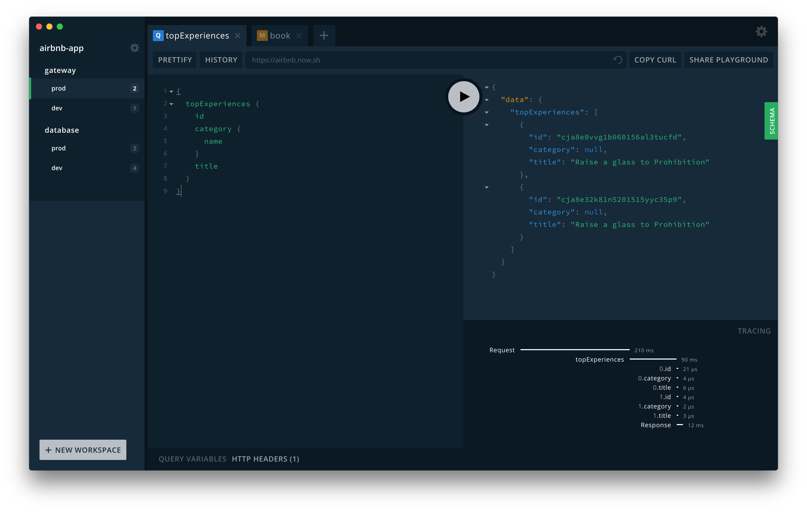
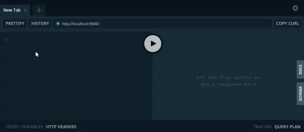
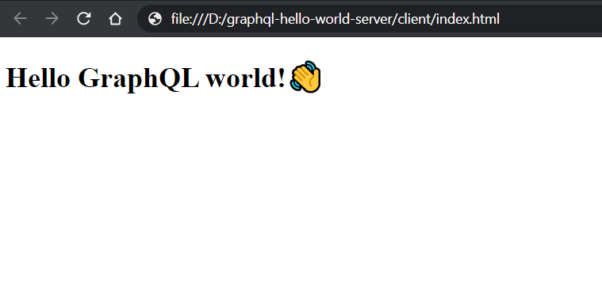

The main purpose of this server-client [Node.js](https://nodejs.org/en/) project is to help other people **understand how GraphQL exposes the data from the Server and the Client fetches it**. I have tried to make it as simple as possible- if you want to dive into the code of the project you can find it [here](https://github.com/reymon359/graphql-hello-world-server).

Now, straight to the point: [GraphQL](https://graphql.org/) is a **query language for [APIs](https://en.wikipedia.org/wiki/Application_programming_interface)** developed and [open-sourced by Facebook](https://engineering.fb.com/core-data/graphql-a-data-query-language/) to speed up the request process.

While [REST](https://en.wikipedia.org/wiki/Representational_state_transfer) has been a popular way to expose data from a server, instead of having **multiple endpoints** that return fixed data structures, GraphQL just has **a single endpoint** and it is the client's job to specify what data it needs from it.

## Table of Contents

- [Getting started](#Getting-started)
- [Define the Schema](#Define-the-schema)
- [Add Resolver function](#Add-resolver-function)
- [Set up the Server](#Set-up-the-server)
- [Set up the Client](#Set-up-the-client)
- [Fetching data from the server](#Fetching-data-from-the-server)
- [Displaying the data](#Displaying-the-data)
- [Conclusion](#Conclusion)
- [Useful resources](#Useful-resources)
  - [Docs 📚](#Docs-)
  - [Learn 📝](#Learn-)
  - [Tools 🔧](#Tools-)
  - [IDEs 💻](#Ides-)
  - [Extras 🍍](#Extras-)

## Getting started

The first step is to [download and install Node.js](https://nodejs.org/en/download/) in case you haven't already. Once you have it installed let's begin with the directory structure. The project will be composed of **two directories**, one for the Client and another for the Server. I have chosen to keep both inside the project root directory but then you can split it into two separate projects or any way you want.

```text
📁project
├── 📁client
└── 📁server
```

Now we will initialize the project in the server directory. Change the location to the server folder in your terminal and run `npm init` to fill the project info and generate the **package.json** file. Or `npm init -y` which tells the generator to use the defaults (instead of asking questions and simply generate an empty npm project without going through an interactive process).

The next step will be to install [GraphQL.js](https://github.com/graphql/graphql-js) and [Apollo Server](https://github.com/apollographql/apollo-server) to our server. GraphQL.js will provide two important capabilities:

- Building a type schema, which we will do in the [next step](#define-the-schema).
- Serving queries against that type schema.

To install it just run `npm install graphql`. I am assuming you are using a version of NPM equal or higher than **5.0.0** so you [do not need](https://blog.npmjs.org/post/161081169345/v500) to add `--save` when installing a dependency to be saved in the package.json

Apollo Server, on the other hand, will help us to implement the GraphQL functionalities. It is part of the [Apollo Data Graph Platform](https://www.apollographql.com/).

> Apollo is a platform for building a data graph, a communication layer that seamlessly connects your application clients (such as React and iOS apps) to your back-end services. Is an implementation of GraphQL designed for the needs of product engineering teams building modern, data-driven applications. - [Apollo Documentation](https://www.apollographql.com/docs/)

What you need to know about Apollo, at least for now, is it’s a community that builds on top of GraphQL, and provides different **tools to help you build your projects**. The tools provided by Apollo are mainly 2: Client and Server.

- **Apollo Client** helps your Frontend communicate with a GraphQL API. It has support for the most popular frameworks such as React, Vue, or Angular and native development on iOS and Android.

- **Apollo Server** is the GraphQL server layer in your backend that delivers the responses back to the client requests.

Now that you understand Apollo better and why we will use it, let's continue setting up GraphQL.

## Define the Schema

A GraphQL Schema is at the core of any GraphQL server implementation. It **describes the shape of your data**, defining it with a hierarchy of **types** with fields that are populated from your data source and also specifies which **queries** and **mutations** are available so the client knows about the information that can be requested or sent.

For example, if we wanted to build a music application, our simplest schema, usually defined in a `schema.graphql` file, would contain two **Object types**: `Song` and `Author` like this

```js
type Song {
  title: String
  author: Author
}

type Author {
  name: String
  song: [Song]
}
```

Then we would have a **Query type** to define the available queries: `getSongs` and `getAuthors`, each returning a list of the corresponding type.

```js
type Query {
  getSongs: [Song]
  getAuthors: [Author]
}
```

To keep it as simple as possible our schema will have just **a single Query** type which will return a String

```js
type Query {
  greeting: String
}
```

We can use **any programming language** to create a GraphQL schema and **build an interface around it** but as I explained before we will use Apollo server to execute GraphQL queries. So we create a new `server.js` file in the server directory to define the Schema on it.

```text
📁project
├── 📁client
└── 📁server
    └── 📄server.js
```

We have to import the **tag function** `gql` from **apollo-server** to parse the schema this way: `const {gql} = require('apollo-server');` and then declare a `typeDefs` constant which is an [abstract syntax tree](https://en.wikipedia.org/wiki/Abstract_syntax_tree) of the Graphql code.

> When a GraphQL server receives a query to process it generally comes in as a String. This string must be tokenized and parsed into a representation that the machine understands. This representation is called an abstract syntax tree.

If you want to learn more about abstract syntax trees [AST Explorer](https://astexplorer.net/) is an online tool that lets you explore the syntax tree created by a chosen language as a parser.

The `server.js` file would look like this.

```js
const { gql } = require('apollo-server');

const typeDefs = gql`
  type Query {
    greeting: String
  }
`;
```

## Add Resolver function

Now we have defined our Schema we need a way to answer the client requests for that data; the **resolvers**.
**A resolver is a function that handles the data for each one of the fields of your schema**. You can send that data to the client by **fetching a back-end database** or a third-party **API** among others.

They have to **match the type definitions of the Schema**, in our case, we just have one type definition Query which returns a greeting of type String so we will define a resolver for the `greeting` field, like so:

```js
const resolvers = {
  Query: {
    greeting: () => 'Hello GraphQL world!👋',
  },
};
```

As I explained at the beginning we will keep this example as simple as possible but keep in mind that in a real case **here is where you have to make the queries** to the database, external API, or from wherever which you intend to extract the query data.

## Set up the Server

In the same `server.js`, we define and create a new `ApolloServer` object passing the `Schema` (typeDefs) and `resolvers` as parameters.

```js
const { ApolloServer, gql } = require('apollo-server');

const server = new ApolloServer({ typeDefs, resolvers });
```

Then calling the `listen` method we start the server on the `port` that we specify in the params.

```js
server
  .listen({ port: 9000 })
  .then(serverInfo => console.log(`Server running at ${serverInfo.url}`));
```

We can also **destructure** the ServerInfo `url` when logging it.

```js
server
  .listen({ port: 9000 })
  .then(({ url }) => console.log(`Server running at ${url}`));
```

The `server.js` file should look like this right now.

```js
const { ApolloServer, gql } = require('apollo-server');

const typeDefs = gql`
  type Query {
    greeting: String
  }
`;

const resolvers = {
  Query: {
    greeting: () => 'Hello GraphQL world!👋',
  },
};

const server = new ApolloServer({ typeDefs, resolvers });
server
  .listen({ port: 9000 })
  .then(({ url }) => console.log(`Server running at ${url}`));
```

Now if we run `node server/server.js` we will finally have our GrapqhQL server up and running🎉!

You can go and check it on [http://localhost:9000/](http://localhost:9000/)

```cmd
~/graphql-hello-world-server
> node server/server.js
Server running at http://localhost:9000/
```

For the first time using GraphQL, you may be thinking **what is this application I am seeing in front of me if we have not written a single line of client code?**.

The answer to that question is the **GraphQL Playground**.



> [GraphQL Playground](https://github.com/prisma-labs/graphql-playground) is a graphical, interactive, in-browser GraphQL IDE, created by [Prisma](https://www.prisma.io/) and based on [GraphiQL](https://github.com/graphql/graphiql). - [Apollo docs](https://www.apollographql.com/docs/apollo-server/testing/graphql-playground/)

But what does that mean? It means that this is an environment where we can perform Queries, Mutations, or Subscriptions to our schema and interact with its data.

If you have worked with **RESTful** requests before this would be some kind of equivalent to [Postman](https://www.postman.com/), just that here you **do not have to download and configure anything**, it just **comes by default** with Apollo!


So let's try it!

1. On the left panel write the `greeting` query we defined in our schema.
2. Then press the ▶ button that is in the middle.
3. And _Voila!_ On the right panel appears the data we defined in our resolver to return.



## Set up the Client

Now that we have our server up and running let's focus on the client part. We will start creating a `client.html` file inside our client folder.

```text
📁project
├── 📁client
|   └── 📄client.html
└── 📁server
    └── 📄server.js
```

The `index.html` file will have the basics of any `HTML` file and a loading header `<h1>Loading...</h1>` to show the user something while we request the data from the server.

```html
<!DOCTYPE html>
<html lang="en">
  <head>
    <meta charset="UTF-8" />
    <meta name="viewport" content="width=device-width, initial-scale=1.0" />
    <title>Hello World GraphQL Client</title>
  </head>

  <body>
    <h1>Loading...</h1>

    <script src="app.js"></script>
  </body>
</html>
```

## Fetching data from the server

First off, in the same client folder, we create an `app.js` file where we will write the client logic to fetch the data from the server.

```text
📁project
├── 📁client
|   └── 📄client.html
|   └── 📄app.js
└── 📁server
    └── 📄server.js
```

Inside it, we set the server url to which we will make the request.

```js
const GRAPHQL_URL = 'http://localhost:9000/';
```

Next, we define our async function `fetchGreeting()` to, fetch the greeting from the server. We will use the [fetch API](https://developer.mozilla.org/en-US/docs/Web/API/Fetch_API/Using_Fetch) to perform the HTTP request which by default returns a promise to which we can subscribe and get the answer in an asynchronous way.

```js
async function fetchGreeting() {
  const response = await fetch(GRAPHQL_URL, {
    method: 'POST',
    headers: {
      'content-type': 'application/json',
    },
    body: JSON.stringify({
      query: `
        query {
          greeting
        }
      `,
    }),
  });

  const responseBody = await response.json();
  console.log(responseBody);
}
```

A detail to take into account is that the method of the request is `POST`, which can confuse us if we are used to working with `RESTful` because this same request made in `RESTful`, where we just want to read information from the server, would be usually done using the method `GET`.

The thing is that with GraphQL we always make `POST` requests where we pass **the query in the payload** (body).

Finally, we just call our method `fetchGreeting();`

```js
const GRAPHQL_URL = 'http://localhost:9000/';

async function fetchGreeting() {
  const response = await fetch(GRAPHQL_URL, {
    method: 'POST',
    headers: {
      'content-type': 'application/json',
    },
    body: JSON.stringify({
      query: `
        query {
          greeting
        }
      `,
    }),
  });

  const responseBody = await response.json();
  console.log(responseBody);
}

fetchGreeting();
```

If you open the file in your browser and see the **console on the developer tools** you can see that we actually got the greeting data from the query🙌!


## Displaying the data

Now that we have successfully got the data from the server let's **update the loading title**. The first thing we will do is destructure the response and return just the `data` from it.

Just replace this part of the code

```js
const responseBody = await response.json();
console.log(responseBody);
```

With this one

```js
const { data } = await response.json();
return data;
```

And then we will update the title with the `greeting` returned **inside the data from the response**

```js
fetchGreeting().then(({ greeting }) => {
  const title = document.querySelector('h1');
  title.textContent = greeting;
});
```

So our `app.js` file will end up having this look

```js
const GRAPHQL_URL = 'http://localhost:9000/';

async function fetchGreeting() {
  const response = await fetch(GRAPHQL_URL, {
    method: 'POST',
    headers: {
      'content-type': 'application/json',
    },
    body: JSON.stringify({
      query: `
        query {
          greeting
        }
      `,
    }),
  });

  const { data } = await response.json();
  return data;
}

fetchGreeting().then(({ greeting }) => {
  const title = document.querySelector('h1');
  title.textContent = greeting;
});
```

And our `index.html` will have the loading title updated with the data fetched from our server!🎉



## Conclusion

I hope you enjoyed the post and that this project has fulfilled the objective of showing **how graphql works under the hood**, at least in a very simple way. I know there are a lot of things that I have not explained or that I could have gone deeper but like any `hello world` project, it is intended for people who are beginners with it, so I wanted to keep it as simple as possible.

I'm looking forward to learning more about GrapqhQL and using it in future projects. If you've got any questions, suggestions, or feedback in general, don't hesitate to reach out on any of the social networks from [my site](https://ramonmorcillo.com) or <a ref="mailto:hey@ramonmorcillo.com">by mail</a>.

## Useful resources

Here is a collection of links and resources which have been useful for me to improve and learn more about GraphQL

### Docs 📚

- [Project source code](https://github.com/reymon359/graphql-hello-world-server) - The Github repository with all the code from the project.
- [GraphQL main site](https://graphql.org/) - GraphQL main site.
- [Apollo documentation](https://graphql.org/) - The Apollo platform docs.

### Learn 📝

- [How to GraphQL](https://www.howtographql.com/) - Free and open-source tutorials to learn all around GraphQL to go from zero to production.
- [GraphQL by Example](https://www.udemy.com/course/graphql-by-example/) - Great course where you learn GraphQL by writing full-stack JavaScript applications with Node.js, Express, Apollo Server, React, Apollo Client.
- [Introduction to GraphQL](https://graphql.org/learn/) - A series of articles to learn about GraphQL, how it works, and how to use it.

### Tools 🔧

- [Apollo GraphQL](https://www.apollographql.com/) - Main site of the Apollo GraphQL implementation.
- [GraphQL Playground](https://github.com/prisma-labs/graphql-playground) - Repository of the GraphQL Playground IDE we used on the project.

### IDEs 💻

- [JS GraphQL](https://plugins.jetbrains.com/plugin/8097-js-graphql) - WebStorm and other IntelliJ-based IDEs plugin to support GraphQL language including tagged template literals in JavaScript and TypeScript.
- [GraphQL](https://marketplace.visualstudio.com/items?itemName=Prisma.vscode-graphql) - GraphQL extension for VSCode adds syntax highlighting, validation, and language features like go to definition, hover information, and autocompletion for GraphQL projects. This extension also works with queries annotated with gql tag.
- [GraphQL for VSCode](https://marketplace.visualstudio.com/items?itemName=kumar-harsh.graphql-for-vscode) - VSCode GraphQL syntax highlighting, linting, auto-complete, and more!

### Extras 🍍

- [GraphQL APIs](https://github.com/APIs-guru/graphql-apis) - A list of public GraphQL APIs to test your skills or to build something with them.
- [GraphQL: The Documentary](https://www.youtube.com/watch?v=783ccP__No8) - A 30 min video that explores the story of why and how GraphQL came to be and the impact it's having on big #tech companies worldwide, including Facebook, Twitter, Airbnb, and Github.
