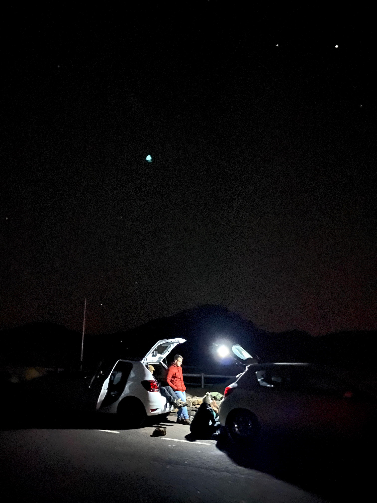
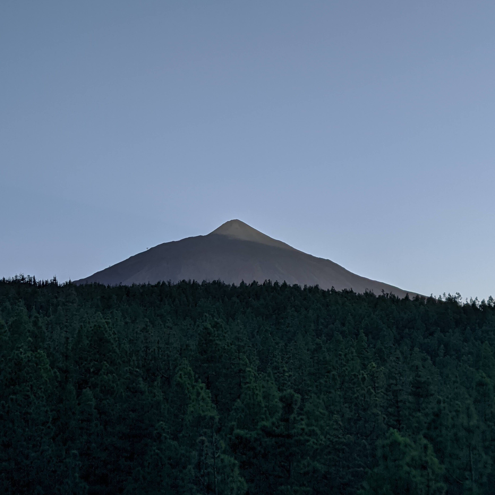

Last month some friends and I made it to the **Teide’s summit (3.718 m) at night** to enjoy the sunrise from it. The experience was probably one of the best I have had in life and after being asked multiple times how we did it (route, clothes, timings, ...) I decided to explain it here for anyone interested in doing it. By the way, I added a [TLDR version at the end of the article](#TLDR) in case you don’t want to read all of it.

We were a five people group, a good number to stay close enough during the hike and not spread out. Remember this is not a normal hike given the fact of doing it at night so, even if you are in good shape **it can be tough for casual hikers.**

## Table of Contents

- [Basic information](#Basic-information)
- [Before the Hike](#Before-the-Hike)
- [The Route](#The-Route)
    - [Getting to the starting point](#Getting-to-the-starting-point)
    - [Montaña Blanca](#Montaña-Blanca)
    - [The Peak](#The-Peak)
    - [Taking the cable-car down](#Taking-the-cable-car-down)
- [Greetings](#Greetings)
- [Resources](#Resources)
- [TLDR](#TLDR)

## Basic information

Some things you must know about the adventure:

- As said in the title, the Teide is the **biggest mountain in Spain** with a high of **3718 meters.**
- About the hike, the distance is around **8 km** with a very steep slope including **gradients of up to 60%** and takes about **5.5 hours** on average. The start point altitude is 2348 m so, the **elevation gain is 1370 m.**
- In case you are thinking of doing it by daytime, you’ll need **permission to hike it from 9 am until 6 pm.** You automatically get permission to hike up the tip If you plan to stay on the refuge.
- There is a **cable car,** but it **does not run on windy days.** Take it into account because you may end up hiking it down too.

## Before the Hike

Check the **weather**. This includes temperature, wind, and precipitation. [On this site,](https://www.volcanoteide.com/es/teide-hoy) you can have a look at the Live forecast of the Teide and its paths. It will be very cold, so you will need appropriate clothing. You should dress up with **winter clothing** which means gloves, and a hat at least.

Buy the way down **cable-car ticket (13 euros)**. After the effort made hiking it you will take the cable car to reach the base. Make sure to buy it and don’t forget to bring it with you.

## The Route

Lorem ipsum

### Getting to the starting point

Lorem ipsum

### Montaña Blanca

Lorem ipsum

### The Peak

Lorem ipsum

### Taking the cable-car down

Lorem ipsum

## Greetings

Lorem ipsum

## Resources

Lorem ipsum

## TLDR

Lorem ipsum
	
