Last month some friends and I made it to the **Teide’s summit (3.718 m) at night** to enjoy the sunrise from it. The experience was probably one of the best I have had in life and after being asked multiple times how we did it (route, clothes, timings, ...) I decided to explain it here for anyone interested in doing it. By the way, I added a [TL;DR version at the end of the article](#TLDR) in case you don’t want to read all of it.

We were a five people group, a good number to stay close enough during the hike and not spread out. Remember this is not a normal hike given the fact of doing it at night so, even if you are in good shape **it can be tough for casual hikers.**

## Table of Contents

- [Basic information](#Basic-information)
- [Before the Hike](#Before-the-Hike)
- [The Route](#The-Route)
    - [Getting to the starting point](#Getting-to-the-starting-point)
    - [Montaña Blanca](#Montaña-Blanca)
    - [The Peak](#The-Peak)
    - [Taking the cable-car down](#Taking-the-cable-car-down)
- [Acknowledgments](#Acknowledgments)
- [Resources](#Resources)
- [TL;DR](#TLDR)

## Basic information

Some things you must know about the adventure:

- As said in the title, the Teide is the **biggest mountain in Spain** with a high of **3718 meters.**
- About the hike, the distance is around **8 km** with a very steep slope including **gradients of up to 60%** and takes about **5.5 hours** on average. The start point altitude is 2348 m so, the **elevation gain is 1370 m.**
- In case you are thinking of doing it by daytime, you’ll need **permission to hike it from 9 am until 6 pm.** You automatically get permission to hike up the tip If you plan to stay on the refuge.
- There is a **cable car,** but it **does not run on windy days.** Take it into account because you may end up hiking it down too.

## Before the Hike

Check the **weather**. This includes temperature, wind, and precipitation. [On this site,](https://www.volcanoteide.com/es/teide-hoy) you can have a look at the Live forecast of the Teide and its paths. It will be very cold, so you will need appropriate clothing. You should dress up with **winter clothing** which means gloves, and a hat at least.

Buy the way down **cable-car ticket (13 euros)**. After the effort made hiking it you will take the cable car to reach the base. Make sure to buy it and don’t forget to bring it with you.

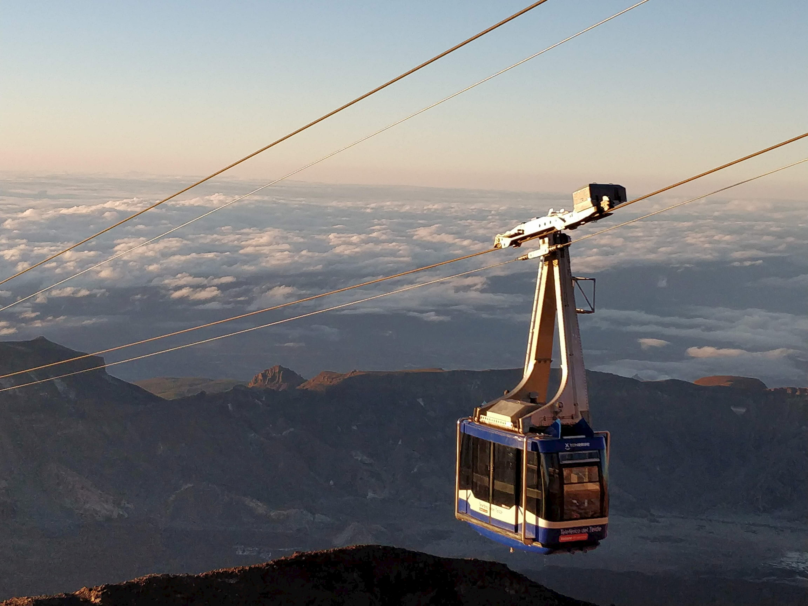

Get your body and mind used to **staying up late**. I normally go to bed and wake up early, changing my normal schedule and staying up until very late the days before the hike helped me that night. Besides, drinking **coffee** and/or tea before and during the hike was a great idea to fight sleep.  Prepare some flasks full of it and obviously, do not forget **water and food** for the hike.

**Extras**

Check the calendar for the next **full moon**. When climbing Teide that night or a nearby one the landscape views were beautiful, and we didn't need a flashlight. The negative point is that we couldn't see the [stars](./../basic-tips-for-amateur-star-photography) properly. However, you can see them every night from any high spot on the island. Thus said, the night landscape views from the Teide are obviously better while full moon.

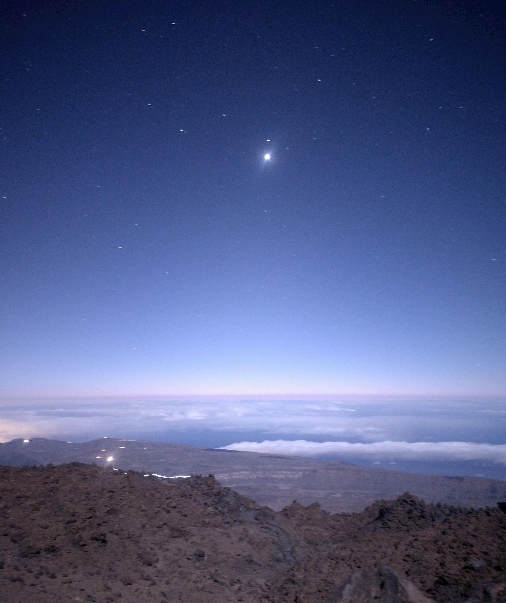

If you can afford it, try to **drive there in more than one car.** The path does not begin where the cable car drops you off. You will have to walk back to where you parked the car at the beginning of the trail unless you have a second car. Therefore, the _trick_ is to leave one of them in a car park near the cable-car Base Station before heading to the starting spot with the second car. This way **when you get off the cable car exhausted you won't have to walk another 40 min** to get to the car.

](./night_talks_under_the_stars.jpg)

Is a good idea to spend some hours at the base before the adventure. We got to the starting point late in the evening to have a picnic dinner and start **getting used to the high altitude hours before the hike.** This will help you to prevent [altitude sickness.](https://en.wikipedia.org/wiki/Altitude_sickness)

## The Route

](./full_route_infographic.jpg)

### Getting to the starting point

**The trail begins at path 7 - Montaña Blanca (2.320 m).** We got there from _La Orotava_ following the signs that led us to the Teide. At some point, you will get over the level of the clouds, do yourself a favor, and stop to contemplate **the sea of clouds.**

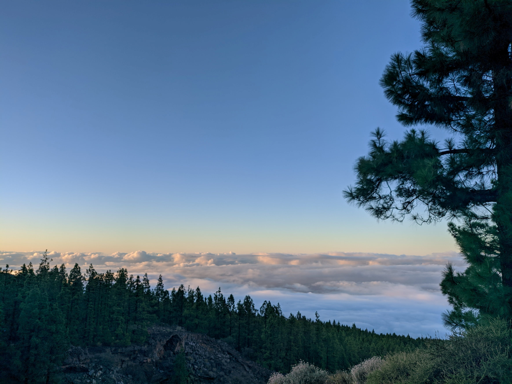

A while after you will notice the lack of vegetation on the landscape which means you are entering the Teide National Park.

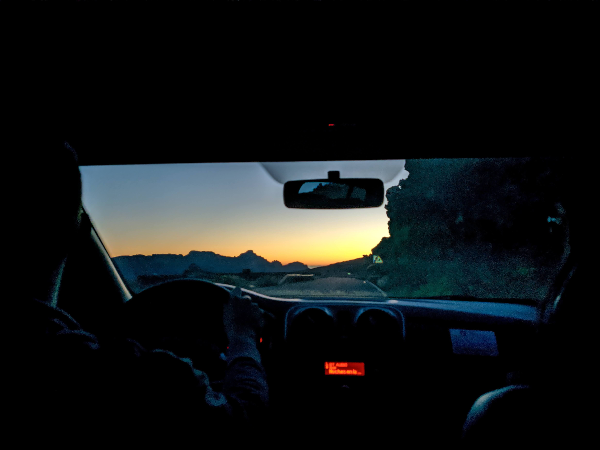 

If you go in one car **head to the beginning of the Montaña Blanca path** and wait there until beginning the ascension. If you manage to get two cars, keep driving until the cable-car Base Station and leave one in the car park near it. Then go back with the other car to the Montaña Blanca starting point. Here you’ll have to **wait until around 1:00 am to begin.** 

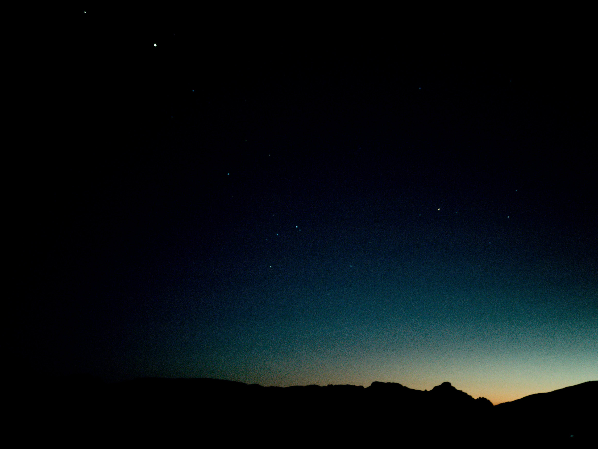

### Montaña Blanca

This path starts easily with a low gradient ascending walk that lasts an hour and a half. You’ll see on the way some **Teide eggs,** big pieces of solidified lava that descended like volcanic snowballs when the volcano erupted.

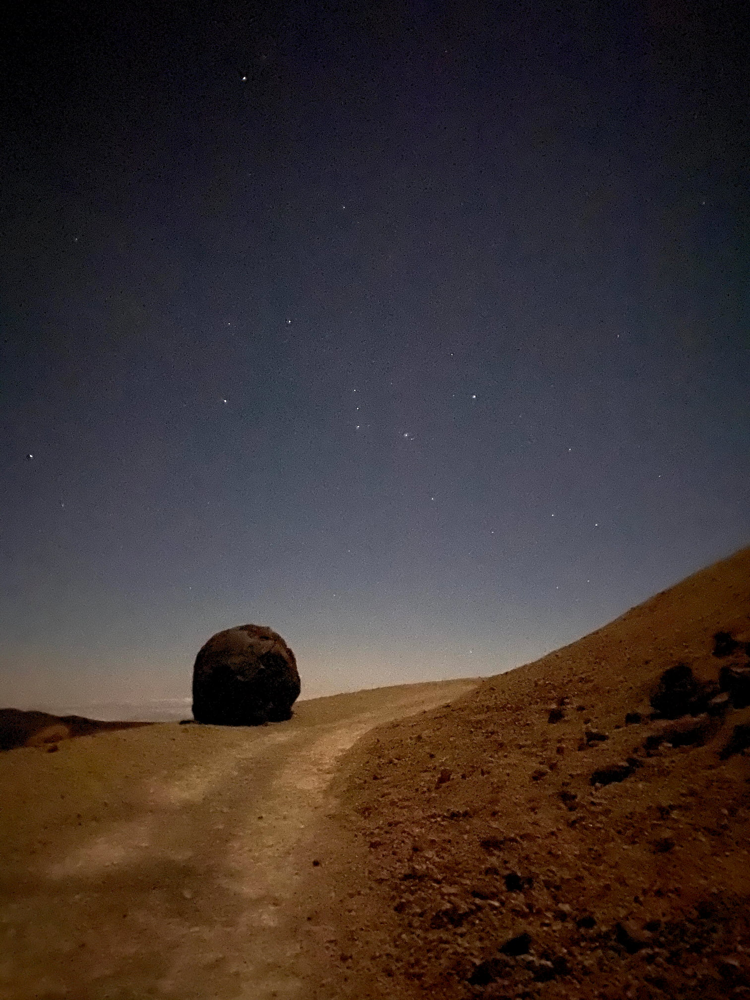

At some point through Montaña Blanca before reaching the cable-car Upper Station (3.550 m), the path will be narrower and present a strong gradient, which sometimes exceeds 60%.

You will pass by the **Altavista Refuge (3.260 m),** where you can rest. Due to Covid reasons, it was closed when we got there, however, we could cover from the wind on the outside with other hikers.

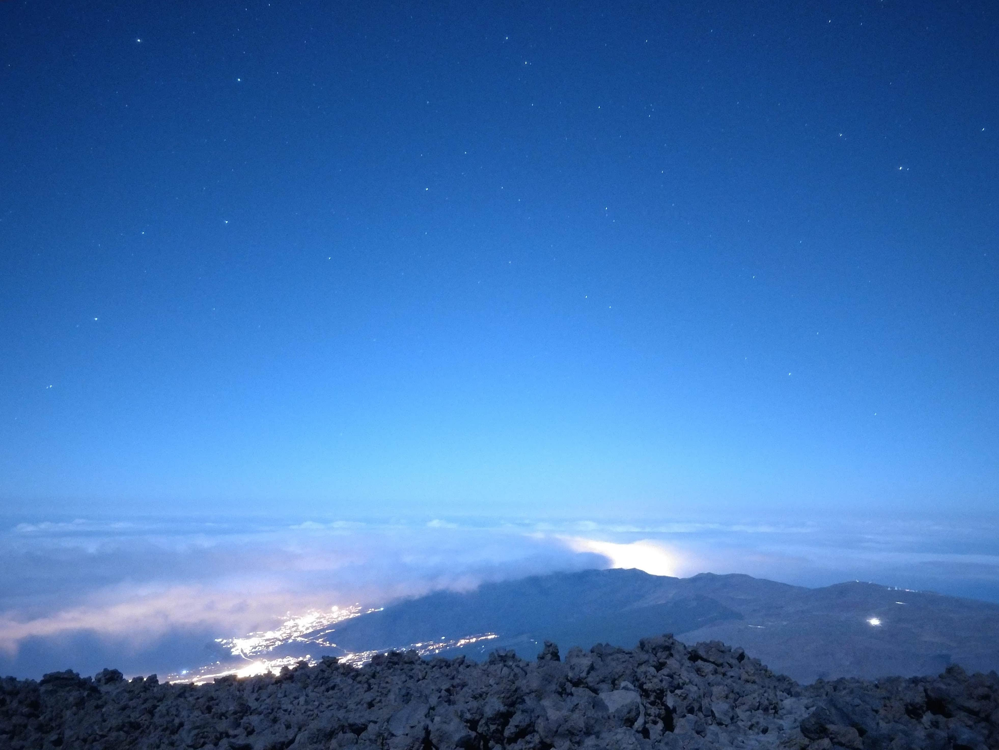

From here to the top it will take one hour more or less. Do not rest too much at the refuge and **pay attention to the times to get to the top before dawn**. Between the refuge and the end, you will find the cable-car Upper Station from where the path to the peak begins. 

### The Peak

The cable-car Upper Station is at 3,550 m, so there are **still 163 altitude meters until the Teide Peak,** at 3,718 m. This last part is called the Telesforo Bravo Trail. A short but steep **40 min trail.** This will be the last effort until you reach the top and contemplate the show.

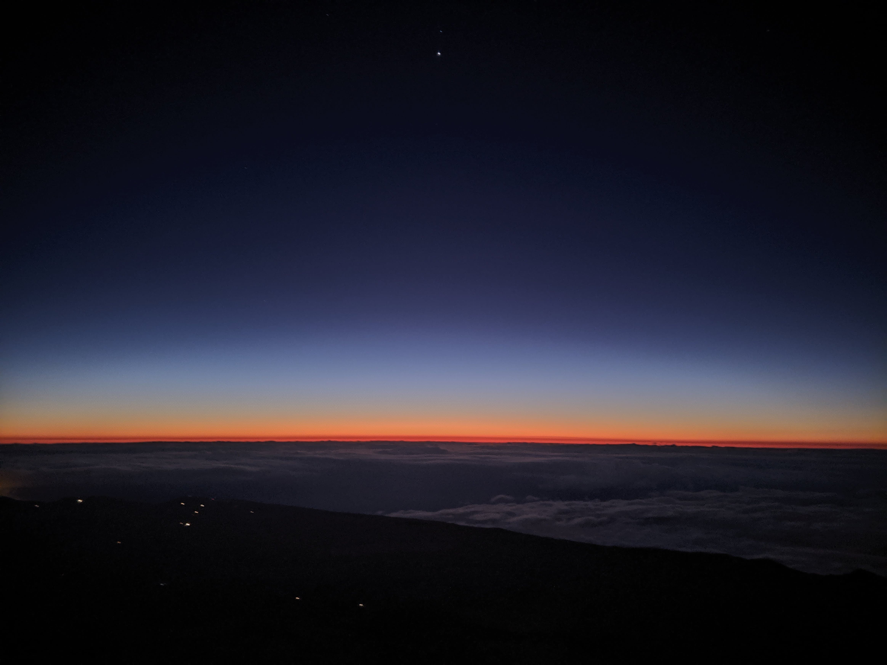

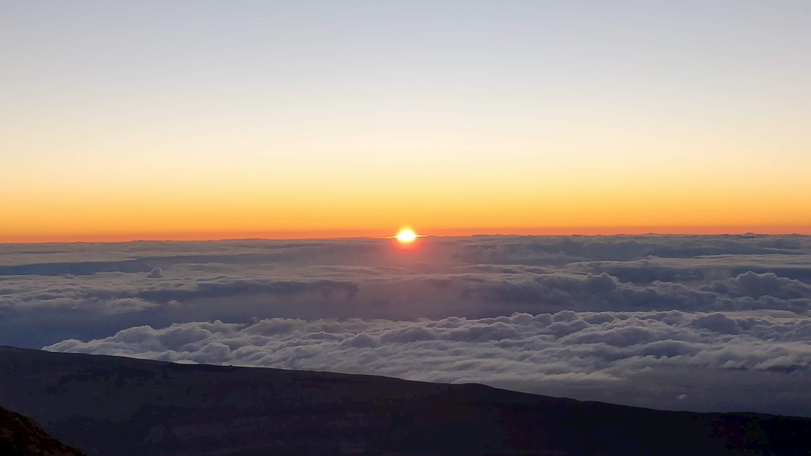

As a curiosity, when you get closer to the top you'll start smelling **sulfur** due to **small active fumaroles** near the summit which emit it. You can get warm near them.

If you wait until the sun is high enough you will also see the Teide’s shadow on the opposite side.

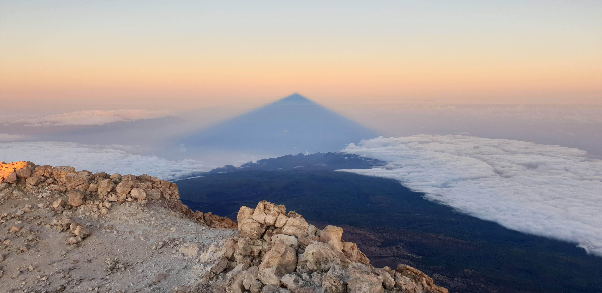

### Taking the cable-car down

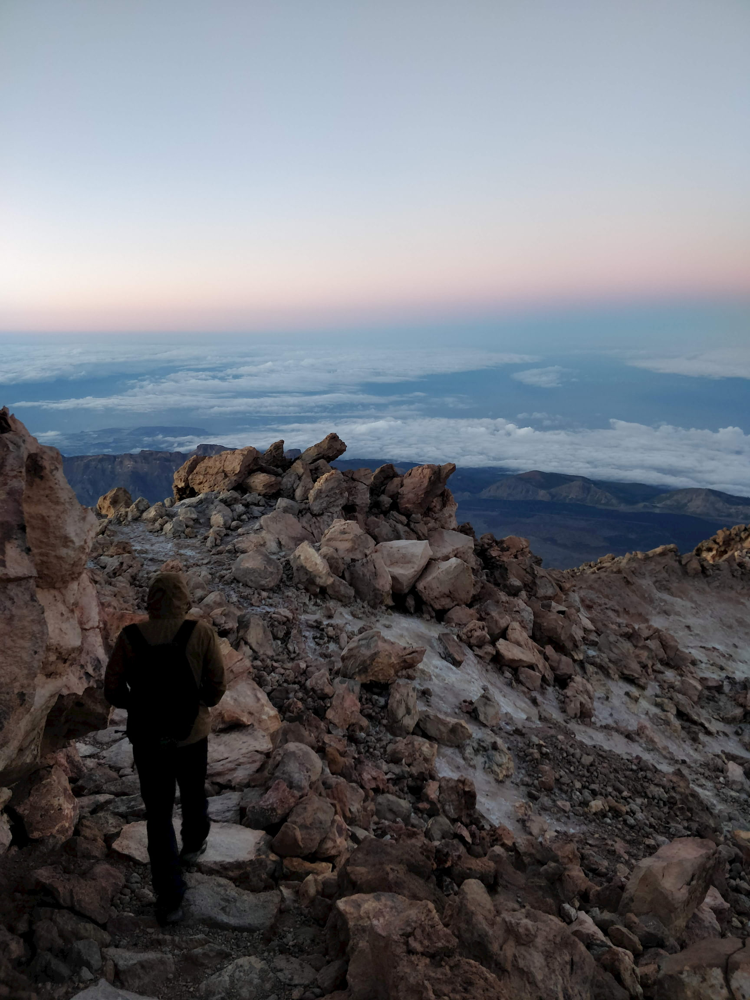

The time will come to start going down to reach the cable-car Upper Station. The first cable car ascends at 09:00 AM and will arrive at the station at **09:10 AM.** If you don’t get it on time, there is one **every 40 minutes.**

Remember to have the cable-car ticket ready because you will be requested to show it. 

`video: title: "Going down in the cable-car": ./going_down_in_the_cable-car.mp4`

Once you reach the cable-car Base Station, head to the car on Montaña Blanca starting Point. If you came with two cars and left the one near the Base Station take it to get to the other one.

And that's all folks. I hope your doubts got solved and if you end up doing it I wish you to enjoy it as much as I did or even more.

## Acknowledgments

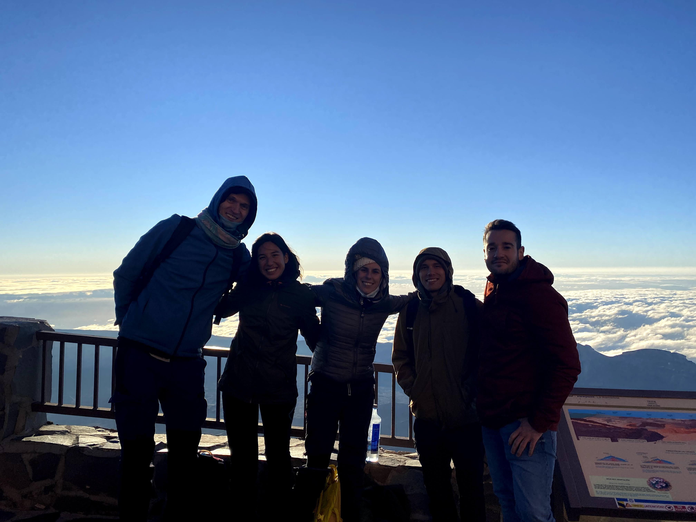

First, to the friends I did the hike with, for their support during it and for making the experience a hundred times better. Second to the random hikers we found and talked and sang with on our way. Finally, special thanks to Eirik for lending me most of the winter clothes to do the hike and don’t freeze. 

`video: title: "Descending together": ./descending_together.mp4`

## Resources

List of useful resources:

- [Official site to buy the cable-car ticket](https://www.volcanoteide.com/es/volcano_teide/teleferico_del_teide/teleferico_del_teide)
- [Live forecast of the Teide and the paths for the next days](https://www.volcanoteide.com/es/teide-hoy)
- [Trail 7 - Montaña Blanca Trail information](https://www.webtenerife.co.uk/what-to-do/nature/hiking/trails/montana-blanca-pico-teide.htm)
- [Other Teide National Park Routes](http://www.gobiernodecanarias.org/parquesnacionalesdecanarias/en/Teide/InfraestructuraServicios/RutasItinerarios.html)

## TL;DR

You start hiking from the base of the Teide at 2356 meters, via Montaña Blanca (Trail no. 7). This starts beside TF-21 highway, at Km. 40.7 (28°15'34"N 16 36'12"W). After hiking for around 3-4 hours, you will reach the Altavista Refuge (3,260 m), then you continue the trail for approximately 1 hour and a half and enjoy the sunrise from the crater (3,718m). So basically, the climb to the top of the Teide, through Montaña Blanca, lasts around 5 hours and a half (only the ascent). After enjoying the amazing sunrise, you go down to take the first cable car at 9 am. The cable car only takes 8 minutes to go back to the base. 

