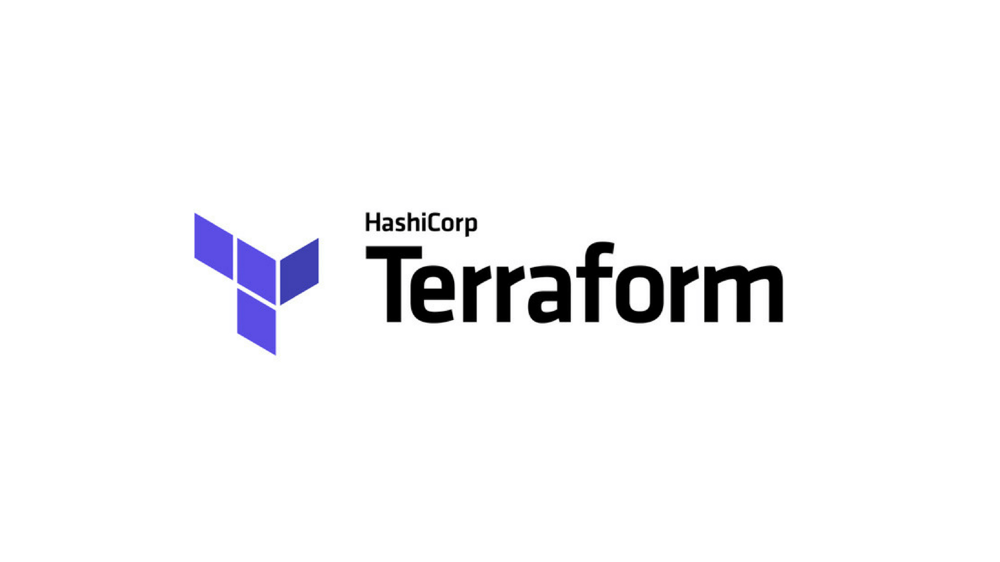
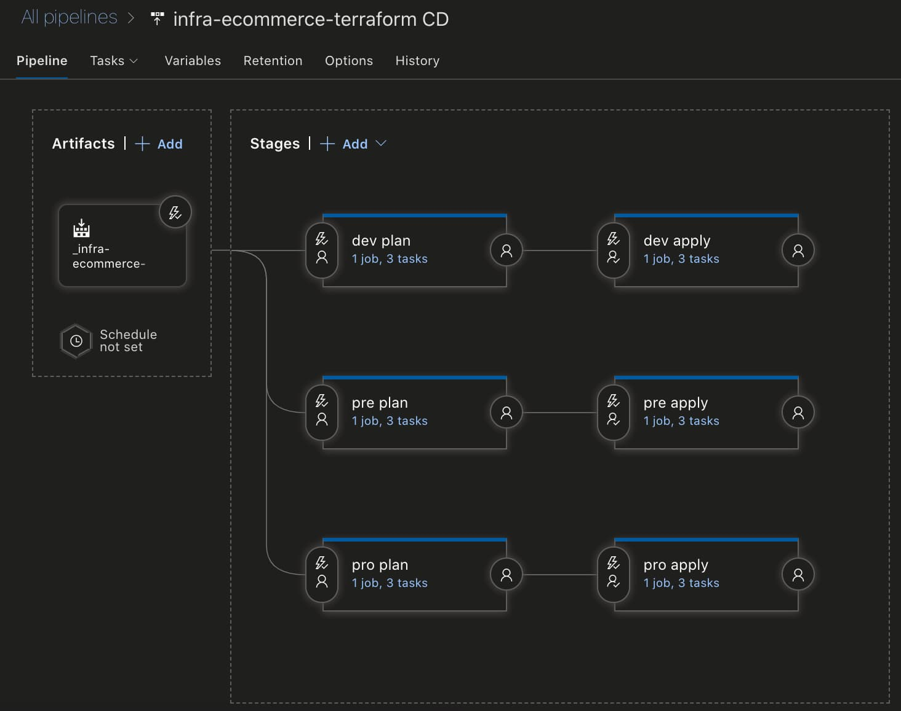

Setting up and maintaining the infrastructure for a [reusable ecommerce platform](https://ramonmorcillo.com/developing-a-reusable-ecommerce-platform/) with a microservice architecture is not an easy task. You have to provide every service with resources, keep track of them and update them when needed.

We use [Azure](https://azure.microsoft.com/en-us/) as our cloud provider to manage all those resources. **Every service uses different resources related to the business logic they handle. **Some of them work with a persistence layer and use resources like [Azure Cosmos DB](https://azure.microsoft.com/en-us/services/cosmos-db/) or [Azure Database for PostgreSQL](https://azure.microsoft.com/en-us/services/postgresql/) databases. Others provide an API to search among a catalog of products with [Azure Cognitive Search](https://azure.microsoft.com/en-us/services/search/).

And how do you keep track of all the resources that are being used?

Here is where [Terraform](https://www.terraform.io/) comes in handy.

## What is Terraform



[Terraform](https://www.terraform.io/) is an open-source infrastructure as code software tool developed by HashiCorp. It provides a consistent CLI workflow to manage hundreds of cloud services in configuration files. [Here](https://learn.hashicorp.com/tutorials/terraform/install-cli) is the official guide on how to install it.

Terraform is a tool that helps you manage various cloud infrastructure services coding configuration files where you can configure the ones needed. It has support for the main cloud providers out there like AWS, Azure, or GCP.

I will enumerate the main features it provides. There are plenty more, however, these are the minimum ones required to understand the tool and this article.

### Modules

Terraform provides modules that help us **reuse our Terraform code.** Our complex infrastructure is broken into multiple modules making it more reusable and simpler to maintain.

It is very easy to convert a given Terraform configuration into modules and Terraform has its eco-system for pre-built modules.

### Resources

Resources are the _key_ element in Terraform. Each of them describes a cloud service such as a computed instance, persistence system, or DNS record.

Here is a simple example of how we would define a resource we want to use in our infrastructure:

```hcl
terraform {
  required_providers {
    food = {
      source  = "hashicorp/food"
      version = "~> 1.0.4"
    }
  }
}

resource "food_tapas" "spanish_omelet" {
  ingredient_1 = "eggs"
  ingredient_2 = "onions"
  Ingredient_3 = "potatoes"
}
```

The language used in Terraform is the _HashiCorp Configuration Language (HCL)._ In the example above we first specify the cloud provider `food`. Then define a resource of the type `food_tapas` with the name `spanish_omelet`. Inside the resource block, we have the configuration arguments which for this delicious resource are the ingredients.

### Terraform Plan

Once all the infrastructure resources have been defined a **Plan** is run. Here Terraform checks the code for syntax errors, state verification, API authentication, and then outputs a summary of the changes.

Running `terraform plan` allows you to check if the plan to be executed for such configuration is the one you were expecting before changing the infrastructure.

Here is an example of the output summary we would get when running `terraform plan` with the example resource

```shell
$ terraform plan
An execution plan has been generated and is shown below.

Resource actions are indicated with the following symbols:
  + create

Terraform will perform the following actions:

  # food_tapas.spanish_omelet will be created
  + resource "food_tapas" "spanish_omelet" {
        + id                = (known after apply)
        + ingredient_1      = "eggs"
        + ingredient_2      = "onions"
        + ingredient_3      = "potatoes"
    }

Plan: 1 to add, 0 to change, 0 to destroy.
```

### Terraform Apply

Once confirmed the summary of changes are the ones wanted, we execute them with `terraform apply`.

After running it successfully the console shows this output.

```shell
 Apply complete! Resources: 1 added, 0 changed, 0 destroyed.
```

And that is an overall view of defining and creating your infrastructure resources in an _automated_ way. All through config files **removing the manual process.** 


## How we use it

Going back to our reusable ecommerce platform. Here is how we take advantage of Terraform’s features to improve our workflow.
### Version Control system

Having all the infrastructure defined in code files means we can use a **VCS** (Version Control System). We opt for Git and host it in a GitHub repository. This way we can keep a history control of the resources we have been using.

In addition, the integration with GitHub allows us to work with pull requests in order to add, change or destroy resources from the Infrastructure.  

### Terraform Variables

Being a reusable platform means its infrastructure has to be the same in every shop we create. With terraform, we accomplish this by defining a [Terraform input variable](https://www.terraform.io/docs/language/values/variables.html) called `shops_to_apply`.

We then pass this variable through the modules and resources where we want to use it.  This way when we apply the plan the changes will happen in each of the shops.

Here is an example of how we would define the variable if we had to set up the infrastructure for three different shops.

```hcl
variable "shops_to_apply" {
  default = {
   happy  = "happyReadings"
   world  = "worldOfWaves"   
   healt  = "healthyFruits"
  }
}
```

Then in each resource, we use a Terraform [for_each meta-argument](https://www.terraform.io/docs/language/meta-arguments/for_each.html) to iterate them.

```hcl
resource "azurerm_postgresql_database" "orders-api-service" {
  for_each            = var.shops_to_apply
  name                = "${each.key}-orders-api-service"
  ... other config
}
```

### Environments and CICD

We work with three environments:

- **Development:** A testing environment where all services new features, refactors, and bug fixes get released once merged to the main repository branch.
- **Staging:** A mirror of the Production environment. When the changes have been properly implemented in Development they are promoted to this environment. In this environment, we can see how they will work in a production-similar situation.
- **Production:** The environment the user has access to. The final environment where the changes get promoted from Staging.

Not all the changes are visible at once in each environment. We use [ConfigCat](https://configcat.com/) as our system of feature flags to make most of the changes visible or not.

We use [GitHub Actions](https://github.com/features/actions) and [Azure DevOps](https://azure.microsoft.com/en-us/services/devops/pipelines/) for our Continuous Integration and Continuous Delivery system. When the changes on the Terraform infrastructure repository are added to the main branch the CICD system gets triggered and the plan is executed on our development environments. When the logs from the plan are the expected ones we manually run the `apply`.



## Conlusions

Having the infrastructure defined as code has brought us nothing but improvements to our platform. Here is a list of them:

- **Reduce human error and increase automation.** The fewer resources you set up manually the fewer errors you get in the long term.
- **It is easier to maintain** since all the infrastructure is coded in config files. Plus we are **using GitHub repositories and Pull Requests** to collaborate all together.
- The infrastructure is **easier to change** compared to traditional manual ways.
- All the configuration files work as **documentation of the resources** we are using.
- Thanks to the use of variables we **speed up the process of setting up new ecommerce platforms.**
- Updating and deleting resources is a delicate topic. Having a proper CICD allows us to **predict and make changes to the infrastructure in the safest way possible.**
- We can effortlessly **provision our development, staging, and production environments with the same consistent configuration.**
