The Canary Islands are a Spanish archipelago located in the Atlantic Ocean, west of Morocco. Here I will share the knowledge and experiences from my time living there for anyone planning to visit the Islands. This guide will provide a general view of them and then focus on the ones I visited.

This guide is based on my own experience therefore some aspects and opinions are not as objective as others.

Here is the map from my [World Places project](https://ramonmorcillo.com/map) where I added some of my favorite places from them and others that people suggested to me. To use it, have a look at the legend and select the layers you are interested in.

<iframe height="350" width="640" src="https://www.google.com/maps/d/u/0/embed?mid=1O0IseePWpXqpT0v6srZyZMRDAvHhpWDg&amp;ll=28.362176239479567%2C-16.220206526556023&amp;z=7"></iframe>

Although I did not visit every island, a good reason to go back in the future, I can confirm a well-known fact about them: _they are all very different._ Each one has different landscapes, cultures, and gastronomy.

This fact is perfect because no matter what your travel style is, you will find one that suits your needs.

Most of the pictures and data from this guide come from my time living there however other external resources properly credited have been used too. 

## Table of Contents

// TODO: FInish this properly

- [Nature](#Nature)	
- [History](#History)	
- [Gastronomy](#Gastronomy)	
- [Islands](#Islands)	
- [Tenerife](#Tenerife)	
- [Gastronomy](#Gastronomy)	
- [Cities and towns](#Cities and towns)	
- [Nature](#Nature)	
- [Gran Canaria](#Gran Canaria)	
- [Gastronomy](#Gastronomy)	
- [Cities and towns](#Cities and towns)	
- [Nature](#Nature)	
- [La Palma](#La Palma)	
- [Gastronomy](#Gastronomy)	
- [Cities and towns](#Cities and towns)	
- [Nature](#Nature)	
- [Fuerteventura](#Fuerteventura)	
- [Gastronomy](#Gastronomy)	
- [Cities and towns](#Cities and towns)	
- [Nature](#Nature)	
- [La Gomera](#La Gomera)	
- [El hierro](#El hierro)	
- [Lanzarote](#Lanzarote)	
- [La Graciosa](#La Graciosa)	
- [Acknowledgments](#Acknowledgments)	

## Nature

Being an Atlantic archipelago of volcanic origin, the nature of the Canary Islands offers original landscapes. A subtropical climate is found among them that varies depending on the altitude.

There is great biological diversity from humid forests to arid deserts and high mountain areas.

Sometimes _Calima_ situations occur. Calima (haze) is the local term used to describe the presence of suspended dust that comes from the African continent (mainly from the Sahara and Sahel deserts).

](./assets/santa_cruz_de_tenerife_covered_by_the_haze.jpg)

The flora is very different compared to the mainland one. From all the new variety of plants you can find here, there is one that stands out and only lives here: The **Canary Islands dragon tree** or **Drago**.

There is another tree that can be found in other parts of the world, however, the variety of the Canary Islands is unique. The **Canary Pine** is the most abundant tree in the Canary Archipelago from where it is endemic. It can reach heights greater than 60 m and the most shocking: Is resistant to fire! This is due to the thickness of the bark which is why it survives moderate fires.

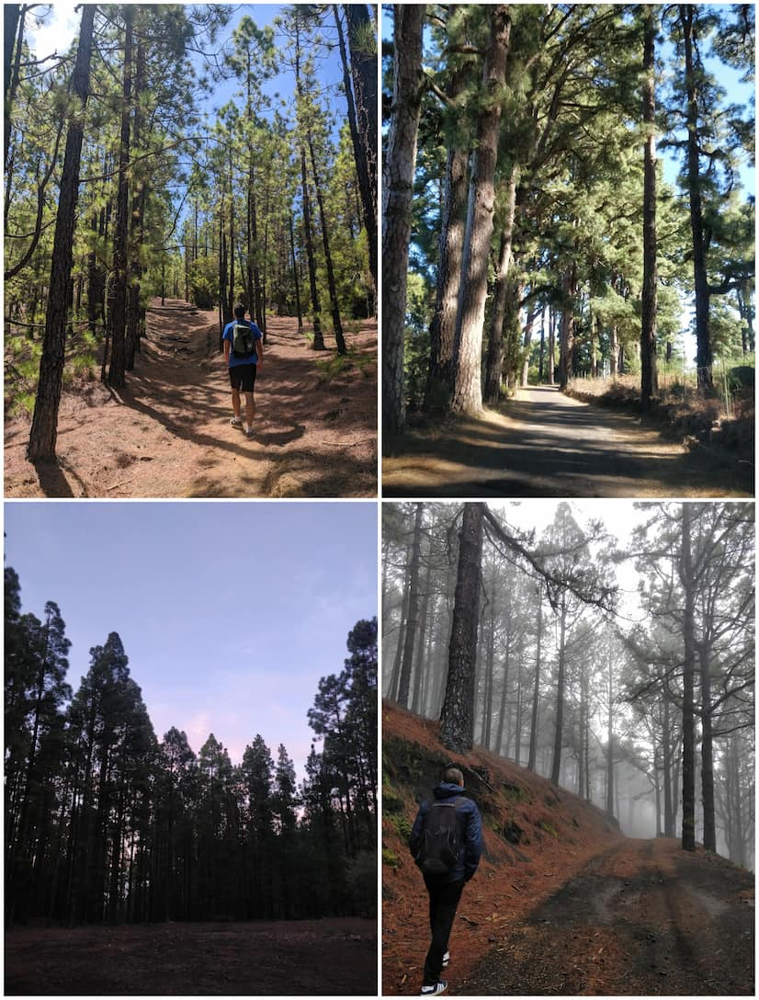

The Canary Islands are known around the globe to be [a perfect stargazing spot.](https://ramonmorcillo.com/basic-tips-for-amateur-star-photography/) The quality and low light pollution of its skies are such that they have multiple Observatories. La Palma and Tenerife have two international astronomical observatories of the International Astronomical Center dedicated to the _study of how the universe in which we live works._

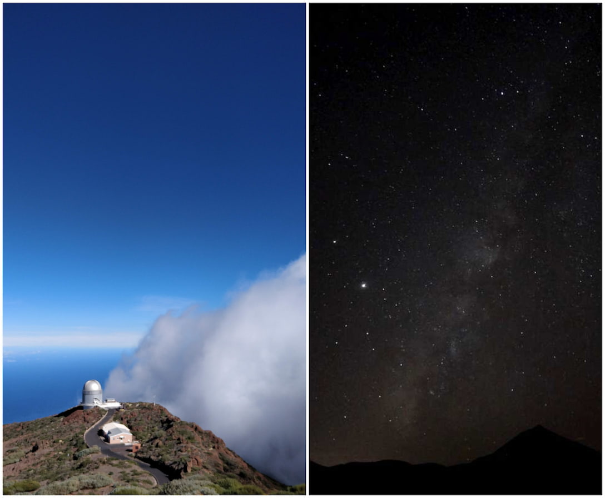

## History

The first Indigenous peoples of the Canary Islands were the **Guanches**. They supposedly arrived from North African and are related to the _Berbers. _However, I heard other theories that relate them to other ancient civilizations like the Vikings, Phoenicians, or Romans.

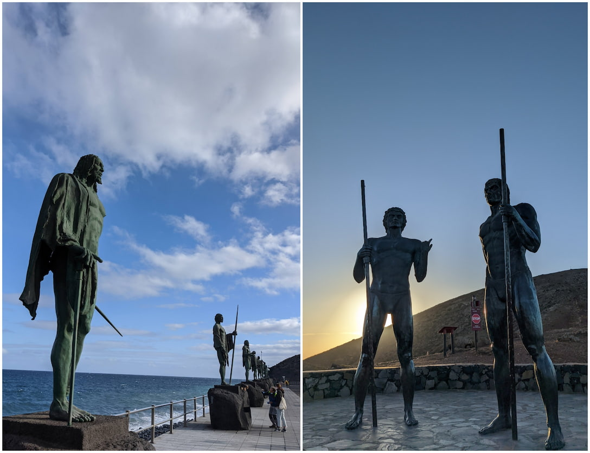

In the 14th century, Europe began to rediscover the islands. And in the **15th the Conquest of the Canary Islands by Spain** started with Lanzarote and Fuerteventura and ended with Tenerife in 1495. **In 1492 Columbus' fleet sailed from La Gomera, towards the New World.**

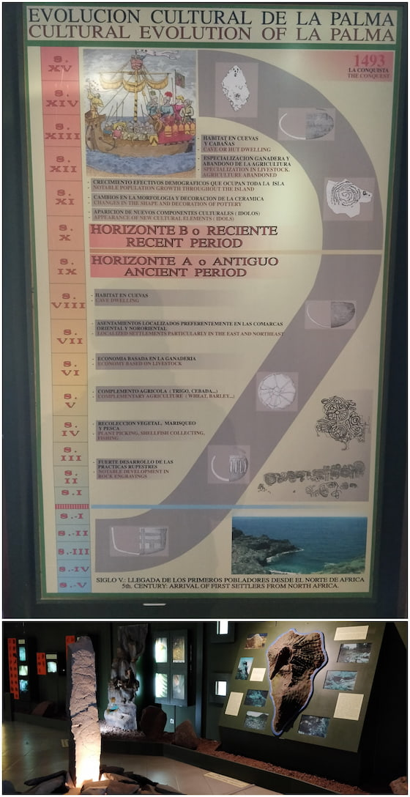

**Until the 18th century,** Immigrants from Europe came to the Canary Islands, and from the Canary Islands, emigrants also left America.

Other nations tried to seize the Canary Islands from Spain. The most famous that could have changed the fate of the archipelago occurred in 1797. The British Vice-Admiral Nelson along with 4000 soldiers were defeated trying to conquer Santa Cruz de Tenerife defended by barely 500 Spaniards, a French detachment, and local militias.

**In the 20th century,** the Spanish civil war, postwar, and the dictatorship of General Franco brought times of misery and emigration, mainly to Venezuela.

Since the 1960s, **mass tourism** has burst into the islands as a new economic alternative, which lasts until today. 

After the approval of the Spanish Constitution in 1982, the process of formation of the State of the Autonomies began. **Nowadays the Canary Islands is one of Spain’s 19 autonomous communities.**

Its **flag** colors represent the two provinces separated by the sea. The white color of the _Province of Santa Cruz de Tenerife_ and the yellow color of the _Province of Las Palmas._

## Gastronomy

Every island has its own distinctive food. However, there are some meals that you will be able to find in all of them. Seafood is very common too, the sea is close after all.

### Papas arrugadas

Probably the most well-known meal from the islands. They are small baked potatoes that are frequently accompanied by _mojos_. They are called **arrugadas** which means they have wrinkles on the skin.

### Mojos

The main sauces from the Canary Islands. The _red mojo_ and the _green mojo_. The red is also known as "mojo picón". Although the red one is the best known outside the archipelago, both are equally important among the islands.

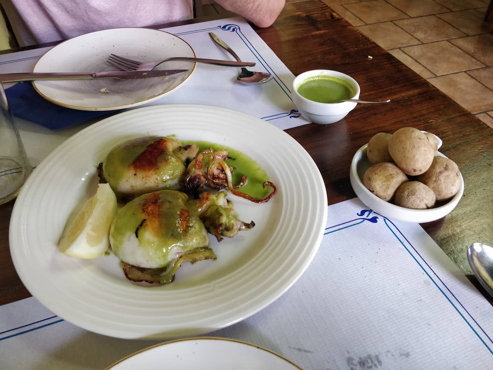

The red one is normally spicier and is made with peppers. It is commonly served with meats while the green one is used for fish and is made with green pepper, parsley, and garlic.

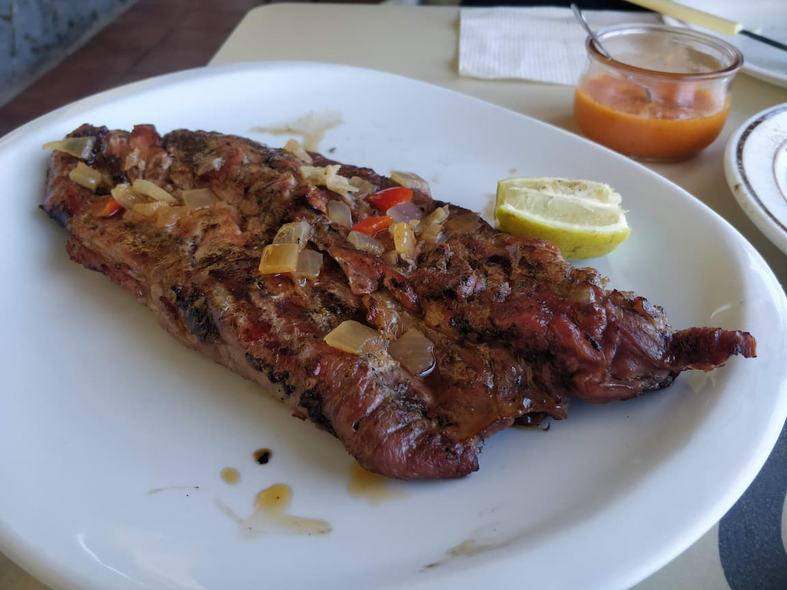

### Goat food

Goats are the dominant farm animal on the islands therefore a lot of meals are made with resources coming from them. The smoked cheese with mojos and or palm honey was my favorite starter there.

### Gofio

If there is a distinctive food from the Canary islands it has to be the Gofio.

> Gofio is a sort of Canarian flour made from roasted grains (typically wheat or certain varieties of maize) or other starchy plants - [Wikipedia](https://en.wikipedia.org/wiki/Gofio)

Canary people use it in plenty of dishes: soups, stews, desserts, etc. If you are in La Palma,  it is worth visiting the Gofio Interpretation Museum (MIGO)  to learn in-depth about this food.

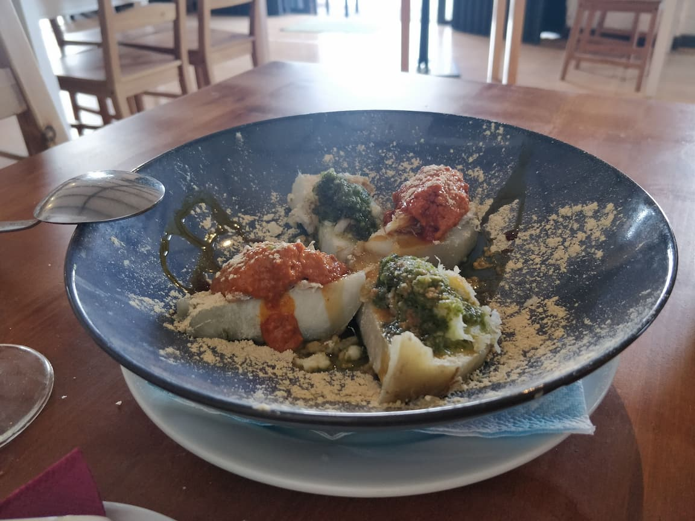

### Desserts

To end the meal there is nothing better than a “Quesillo” or “Polvito Uruguayo”. The first one is a mix between cheesecake and flan. 

The Polvito Uruguayo on the other hand is made of cream, caramel, and cookies.

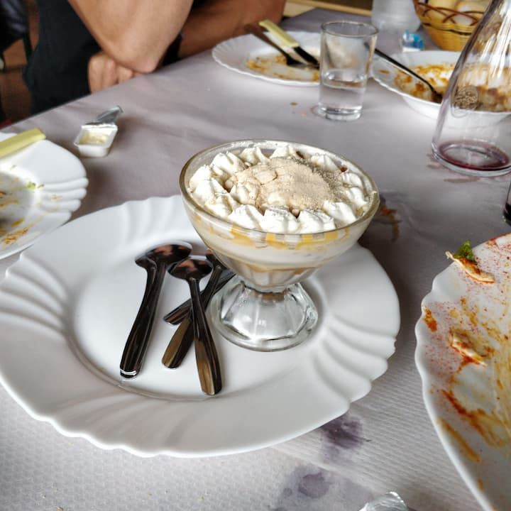

### Venezuelan food

The Canary Islands have historically been influenced by Venezuela and a great part of its population comes from there. Therefore, plenty of its cuisine and restaurants are Venezuelan. Be careful because it’s easy to fall in love with their “Tequeños” and “Cachapas”.

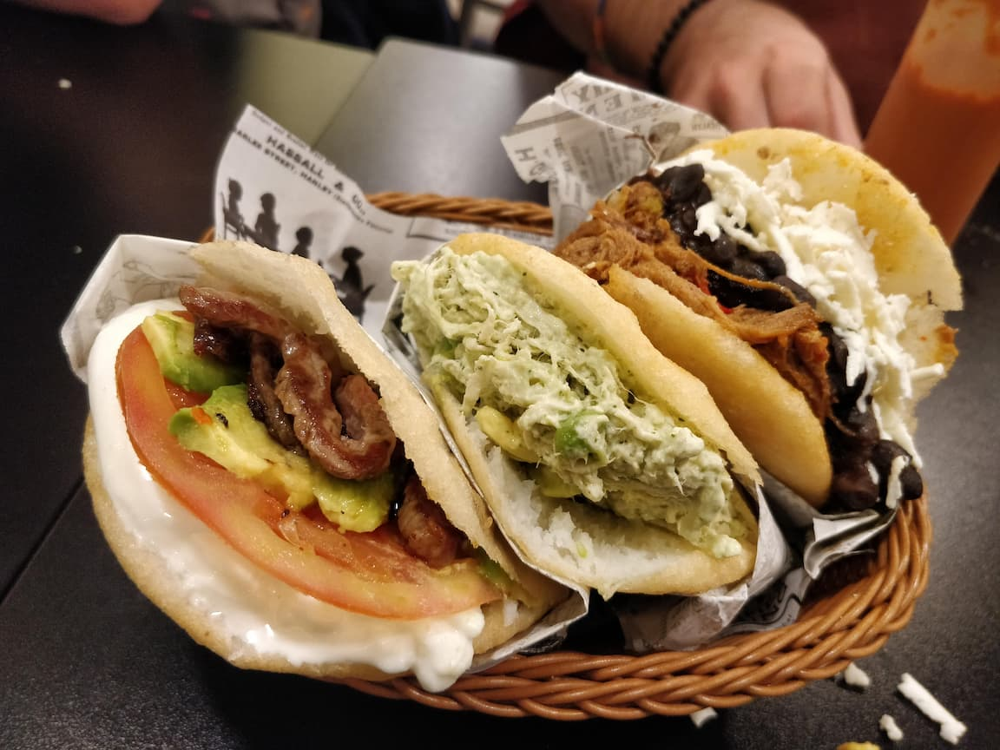

### Fish and Seafood

Fish and seafood are also quite common and of good quality.

### Others

Here are common food products among the Canary Islands very rare around other world places. The most distinctive are the crisps **Munchitos,** the soda **Clipper,** and the candy bars **Ambrosias.**

## Islands

There are eight islands on the archipelago and all of them are unique. I have not visited El Hierro, La Gomera and La Graciosa, _yet._ Therefore I will focus more on the other ones I was able to travel to.

](./assets/map_of_the_canary_islands_from_wikipedia.jpg)

## Tenerife

The greatest of them. This island offers plenty of things to do from beaches, museums, hiking, or visiting local towns. If you are looking for a place to stay when visiting it remember the north of the island has more local life, and the south is more oriented to mass tourism. Therefore, if you want to have a better experience I would suggest you stay on the island’s north side.

### Gastronomy

Tenerife is well-known for its **Guachinches.** They are an establishment where locally produced wine is served accompanied by homemade traditional food. They are originally from the _Orotava Valley._

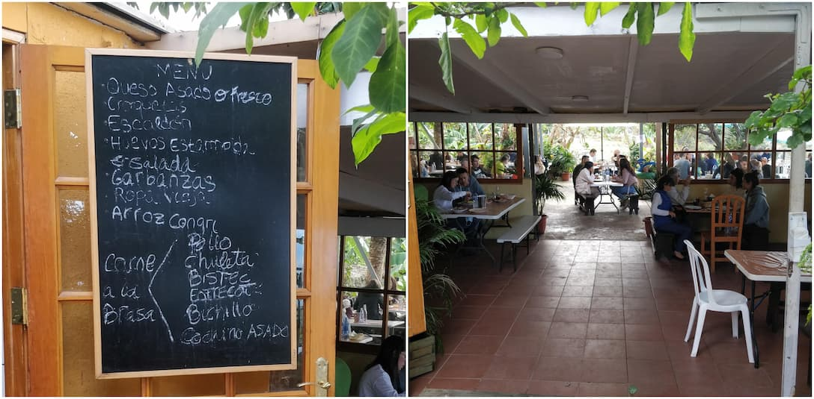

The most typical dishes you should try from these places are the “Ropa vieja”, “Carne de fiesta”, the Gofio-made “Escaldón” and grilled meat. 

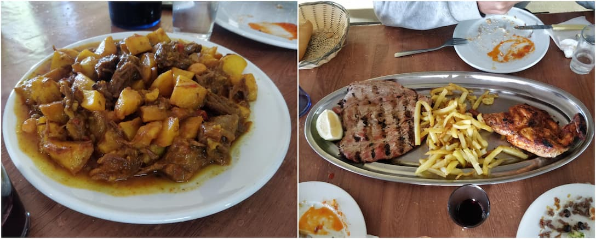

Most of them will also have delicious homemade Spanish croquetas.

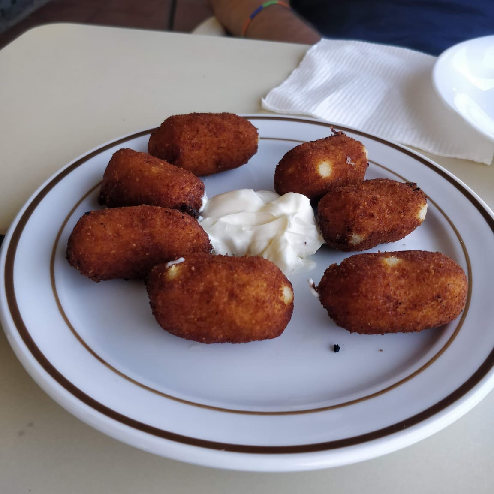

Speaking about croquetas, an honorable mention has to be made to the amazing _banana croquetas_ I ate in Garachico at _Tasca Restaurante Los Pinos._

If you are into **beer** _Dorada_ is the main from Tenerife. Their logo is obviously The Teide. They have a wide variety to choose from.

And for **coffee** lovers, you can’t leave this island without trying the _Barraquito_ or _Zaperoco._ A multi-layered coffee liqueur drink. Each layer references Coffee, Licor 43, milk, and is usually accompanied by cinnamon and or/lemon peel.

### Cities and towns

I will not focus on the most touristic places like Las Américas, Los Cristianos, Puerto de la Cruz, or the Capital of Santa Cruz but on the hidden gems. The local towns worth a visit to see the authentic Tenerife.

**La Laguna or San Cristobal de La Laguna.** Not a town but a city next to the capital Santa Cruz. University city which downtown has been classed as a World Heritage Place. It has its own microclimate and it is usually colder compared to other parts of the island. Remember to bring a jacket just in case.

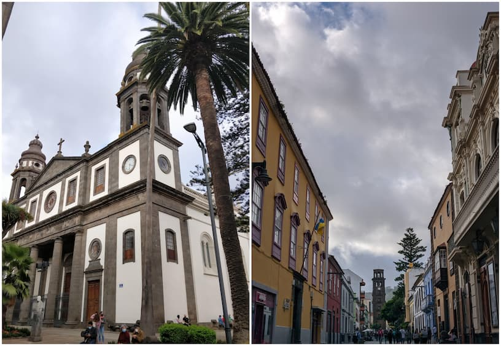

**La Orotava.** A town with plenty of traditional colorful Canarian architecture. You will find traditional Canarias houses with balconies and courtyards. The _Casa de Los Balcones_ is a must-visit to get to know the traditional houses and how people lived there in the past.

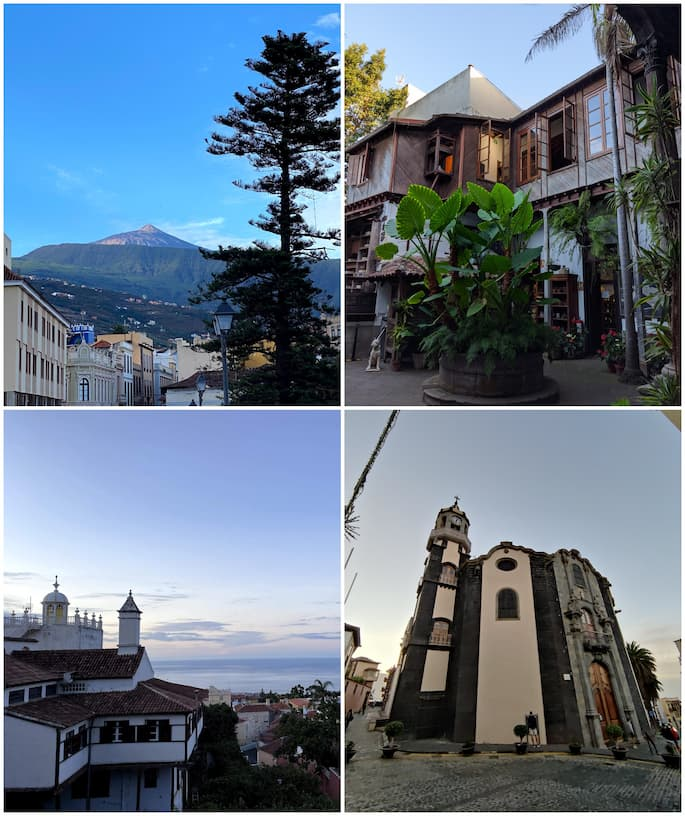

**Icod de Los Vinos.** A large town in the north of the island home to _the oldest Dragon Tree in the world,_ which is believed to be over 800 years old. In addition, it has an amazing butterfly zoo that you should visit whether you like butterflies or not.

**Garachico.** A picturesque coastal town once the most important port on the island until a volcanic eruption buried half the city in 1706.

**Candelaria.** Located on the east coast, south of Santa Cruz. Next to its Basilica, there is a set of nine bronze statues, representing the nine Guanches. The Tenerife tribal leaders at the time of the Spanish conquest.

**Masca.** The "hidden” town from the northwest of the island in the middle of the **Teno Rural Park.**

### Nature

Tenerife is probably the one with the most nature diversity. Different local weather conditions and micro-climates around the island are provided by its unique climate and geography. All these different factors contribute to the presence of multiple types of plants and animals. As well as areas of forests, beaches, deserts, and mountains.

**Teide National Park.** Named after [Mount Teide, the highest peak and volcano in Spain.](https://ramonmorcillo.com/how-to-enjoy-the-sunrise-from-the-top-of-spain/) There are trails that lead to the summit or you can take the cable-car. Other points of interest are the _Pico Viejo_ and the rock formations of _Roques de García._

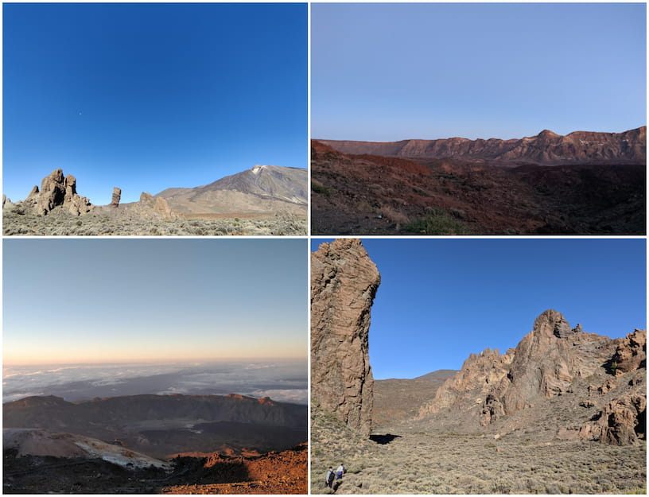

**Rural Anaga Park.** Located in the north of the Island it was declared _Biosphere Reserve._ It is the place with the highest amount of endemism in Europe. It houses from humid dense forests to dream beaches along the Benijo coast.

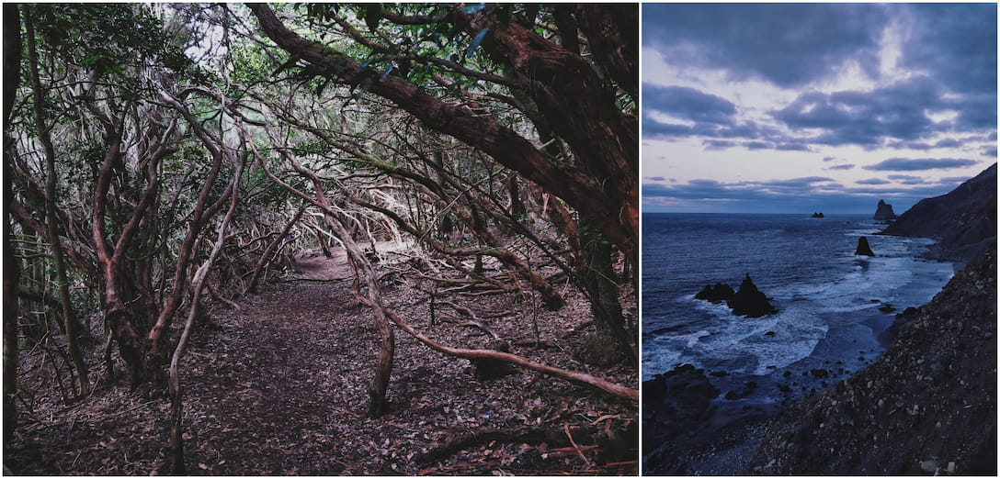

**Teno Rural Park.** Located on the north-west part of the island. The altitudes go from sea level to high peaks. The vegetation of this area varies according to how high you are.

**The Orotava Valley.** Although it is not strictly speaking a valley, is the name given to the north-west lower slopes of the Teide. Named after La Orotava.  _La Caldera_ is one of the best nature spots for hiking here.

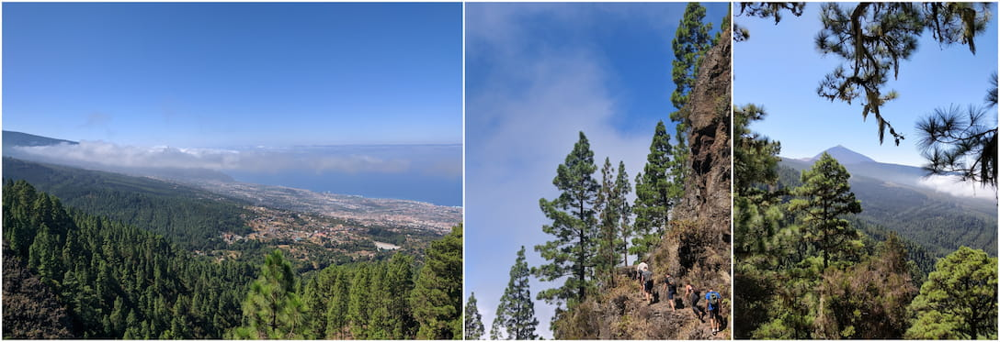

**Charcos.** Around the coast of the island, you can find these beautiful volcanic rock swimming pools.

## Gran Canaria

Home of the Canary Islands capital, Las Palmas de Gran Canaria. As happened in Tenerife, the south of the island is more oriented to tourists while the locals reside in the center and north. It was named this way because of the abundance of large dogs (_can_ in Latin) existing in it.

###  Gastronomy

**Chorizo de Teror.** Original from the Teror locality. This red sausage is similar to the _sobrasada,_ and can be eaten alone or, given its softy, spread on bread.

](./assets/)

**Carne de Cabra.** Goat's meat. This meal is more common in the interior regions of the island such as Tejeda.

**Gofio escaldado.** Very similar to the _escaldón_ from Tenerife. A gofio-made plate accompanied by onions.

**Truchas.** These sweet dumplings are sweets made with sweet potatoes, sugar, and cinnamon. Are found along all the island.

When it comes to drinks, and more specifically **beers,** the classic one from Gran Canaria is the **Tropical.** Known for having the logo of a dog that turns blue when the beer is cold. A nifty way to help people know when it's ready to drink. Mention that **sparkling water** is much more common on this island than on others.

