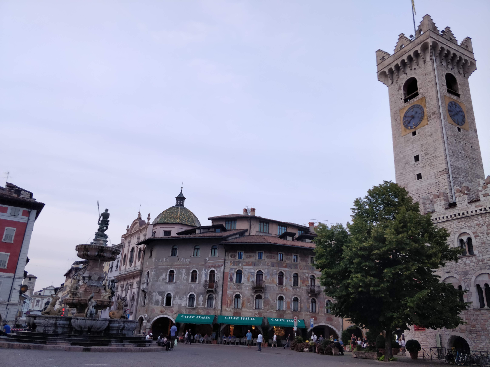
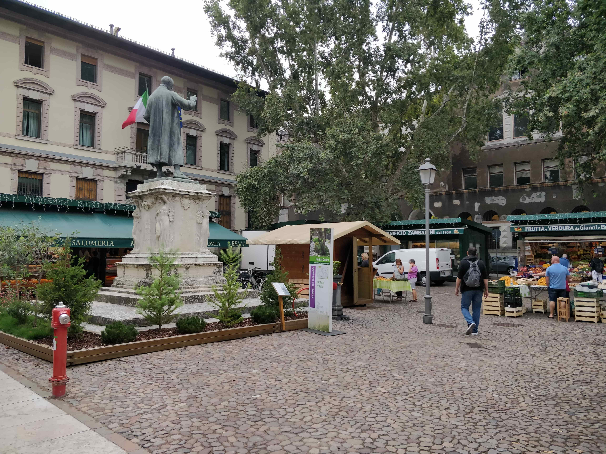
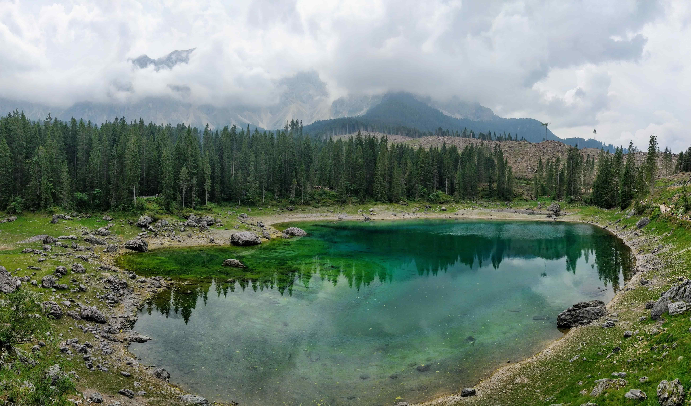
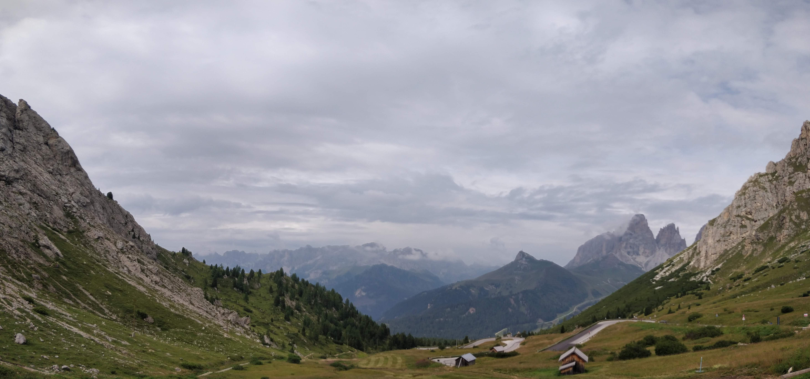

When I told people that I was going to spend some days visiting the Dolomites they had no idea what they were, and, the truth is that neither did I until, a couple of years ago, my mother mentioned that she would like to visit them.

In short, the Dolomites is a mountain range that is part of [the Alps](https://en.wikipedia.org/wiki/Alps). It is located in **northern Italy** in the provinces of Belluno, Bolzano, Trento, Udine, and Pordenone. Although it has many mountains that exceed 3000 m. the highest is the **Marmolada** with **3,342 m**. **They were declared a World Heritage Site by UNESCO in 2009**.

## Table of Contents
- [First day: Trento](#First-day-Trento)
- [Second day: Lago di Carezza](#Second-day-Lago-di-Carezza)
- [Third day: Cortina d'Ampezzo](#Third-day-Cortina-dAmpezzo)
- [Fourth day: Bolzano and Lago di Garda](#Fourth-day-Bolzano-and-Lago-di-Garda)
- [Conclusion](#Conclusion)

## First day: Trento

We left Alicante about 11:00 in the morning and arrive in **Milan** (Malpensa Airport) about **13:00**. Upon arrival we picked up the car that we had previously rented to move during the trip. Although most of the towns and cities are well connected by train and bus, we decided to **rent a car** for having the option to visit places where the buses did not arrive and for the **freedom** that it entails.

We rented the car at **[Autoeurope](https://www.autoeurope.es/)**, a website that I had previously used on a trip to Croatia and that had given me good results. Basically it is a price comparison and car rental companies in which after selecting the days and the point of collection and return shows you a table with the different car models, prices and valuations of each company. In our case we rent a **Golf** for **5 days** for about **120 euros**.

Once with the car we headed towards **Trento** on the highway. If you plan to drive in Italy you should know that the speed limits are:

* **130 km/h** on the highways.
* **110 km/h** on the main roads.
* **90 km/h** on secondary roads
* **50 km/h** in urban areas.

When we arrived in Trento we headed to the hotel which was about 10 minutes by car from the center, on the side of a mountain.

After leaving our luggage, we went down to the center of Trento and parked in one of the **many public car parks** (free after 8) and we turned around.

The city center was not very big but it was full of life and had many charming squares, especially the main one, *Piazza Duomo*.

## Second day: Lago di Carezza

On the second day we took a final tour of Trento in the morning and bought some products of the local cuisine at the *[Mercato Giornaliero](https://goo.gl/maps/mN917WdRzk1FuETP9)*. We took several types of cheese and sausages from the area such as the *Speck*.

> The speck is a ham with a distinctive juniper flavor originating in the historical region of Tyrol, which is cured with salt and smoked. [Source: Wikipedia](https://es.wikipedia.org/wiki/Speck)

Our next objective was the *[Lago di Carezza](https://goo.gl/maps/ZiktEE5wbXXhT9Cf8)*. Although the fastest way was to get to **Bolzano** and then turn off, we decided to go on another slightly longer route, passing through *Pozza di Fassa*, since the Bolzano road we would take on the last day.

<iframe src="https://www.google.com/maps/embed?pb=!1m34!1m12!1m3!1d353153.69068352063!2d11.103147546985761!3d46.24996521522647!2m3!1f0!2f0!3f0!3m2!1i1024!2i768!4f13.1!4m19!3e0!4m5!1s0x478276cac9ce9ddb%3A0x27c6a299139ff547!2sTrento%2C%20Province%20of%20Trento%2C%20Italy!3m2!1d46.074779299999996!2d11.1217486!4m5!1s0x477869237b61dcd9%3A0x99d972828b60eebd!2sPozza%20di%20Fassa%2C%2038036%20Province%20of%20Trento%2C%20Italy!3m2!1d46.4306894!2d11.6857172!4m5!1s0x47786fbe51650425%3A0x26e4d13e4445202f!2sLago%20di%20Carezza!3m2!1d46.4104889!2d11.5758269!5e0!3m2!1sen!2ses!4v1567698533267!5m2!1sen!2ses" width="600" height="450" frameborder="0" style="border:0;" allowfullscreen=""></iframe>

The lake was beautiful, **the blue-green hues of the water** is what most caught my attention. If you have any idea of approaching the shore, you should know that the lake is **fenced around a perimeter**. Which, although it does not allow you to get too close or bathe, prevents people from littering or destroying the area around it.

We end up going along a **trail that surrounds it** along which you can see the lake from different points of view and not very long to travel (half an hour).

Later we arrived in **Canazei** where we stayed in an apartment the rest of the nights. Canazei is a large municipality located in the northern part of the ***Val di Fassa***. It is also a place for snow tourism and base station for excursions and climbs to *Sella*, *Marmolada* and *Sassolungo*.

## Third day: Cortina d'Ampezzo

On the third day we decided to go to **Cortina d'Ampezzo** not only for seeing the city itself, but for the **route through the Dolomites with spectacular views**. In order to see the maximum we went and returned by different paths.

<iframe src="https://www.google.com/maps/embed?pb=!1m44!1m12!1m3!1d87912.80256197359!2d11.885745942173774!3d46.48286366915306!2m3!1f0!2f0!3f0!3m2!1i1024!2i768!4f13.1!4m29!3e0!4m5!1s0x47786a694ab62bc3%3A0xcb8e3fb552a4e7e4!2sCanazei%2C%20Province%20of%20Trento%2C%20Italy!3m2!1d46.4767783!2d11.770364899999999!4m5!1s0x47784034607e7663%3A0x81157a992b3a2fc!2sPasso%20Pordoi!3m2!1d46.487834!2d11.8140476!4m5!1s0x47783435d247033f%3A0xdd3c30437b92e42b!2s32043%20Cortina%20d&#39;Ampezzo%2C%20Province%20of%20Belluno%2C%20Italy!3m2!1d46.5404711!2d12.1356524!4m3!3m2!1d46.4830945!2d12.05416!4m5!1s0x47786a694ab62bc3%3A0xcb8e3fb552a4e7e4!2sCanazei%2C%20Province%20of%20Trento%2C%20Italy!3m2!1d46.4767783!2d11.770364899999999!5e0!3m2!1sen!2ses!4v1567547513219!5m2!1sen!2ses" width="600" height="450" frameborder="0" style="border:0;" allowfullscreen=""></iframe>

On the way we took the route that passes through ***Passo Pordoi*** and on the way back we took the route through ***Passo di Giau***. Both routes lasted about 1 hour and 30 minutes each.

If you decide to rent a car to enjoy the views you will be reassured to know that **the vast majority of roads in the Dolomites are well paved and fit two cars** although they are not delimited by a continuous line in the middle.

Cortina d'Ampezzo is larger than Canazei and is a winter sports complex known for its ski slopes, landscapes, accommodations, shops. It is very frequented by the international jet-set.

On the way back we passed by *Fedaia Lake* from where we could see the **Marmolada Glacier**.

## Fourth day: Bolzano and Lago di Garda

The last day we got up early and went early to **Bolzano** a city west of Canazei and north of Trento. It is a **bilingual city** where **both Italian and German are spoken**. The most remarkable street was ***Via dei Portici***, one of the main streets where shops were located on the sides under porticos.

After Bolzano and on the way to Milan Airport, we stop in a couple of villages on the shores of ***Lago di Garda***, **the largest lake in Italy**. First we were in ***Riva del Garda*** and later ***Peschiera del Garda***.

Both *Riva del Garda* and *Peschiera del Garda* are cities whose *main activity is Tourism*. In Peschiera del Garda was more remarkable than in Riva given the large number of restaurants and shops of tourists on the shore of the lake.

## Conclusion
After having been in other cities and more popular areas of the country years ago this trip has discovered me **an Italy very different from what I was used to** that did not expect at all. The Dolomites is an incredible area that if you have the opportunity to go you should not miss it, but **if you can afford to rent a car to tour it do not hesitate** because otherwise you will probably miss part of the landscapes described above.
